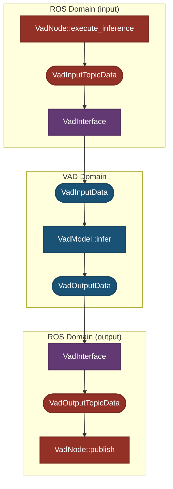

# Design

This document explains the key design concepts of `autoware_tensorrt_vad`.

## Context and scope

While designing perception and planning as loosely coupled components enables easy construction of stable autonomous vehicles, the following challenges exist:

- The interface design between perception and planning architectures constrains the amount of information that can be passed from perception to planning.
  - e.g. If planning component wants to handle a pedestrian walking while using a smartphone, the interface must be designed to pass information like "this pedestrian is using a smartphone while walking" from perception to planning.

In recent years, approaches have been proposed to address these challenges by training sensor input planners (also known as E2E) with large amounts of data. Assuming that users who want to use sensor input planners (also known as E2E) exist in Autoware, we add the ROS Node for [VAD: Vectorized Scene Representation for Efficient Autonomous Driving](https://arxiv.org/abs/2303.12077), which is one of the E2E methods.

## Goals and Non-goals

- Goals
  - Enable users who want to use sensor input planner (also known as E2E) to easily integrate with Autoware

- Non-goals
  - Create the ROS Node that can only be used with specific sensors or vehicles and cannot be used with others

## Concepts

- [Separation between ROS and CUDA domains](#separation-between-ros-and-cuda-domains)
  - Changes to ROS topic types do not affect CUDA implementations
  - Changes to CUDA versions or interfaces do not affect ROS Nodes
- [Separation between model architecture and deployment parameters](#separation-between-model-architecture-and-deployment-parameters)
- [Extensible design for Autoware `camera_id` changes](#extensible-design-for-autoware-camera_id-changes)
  - Even if the front camera ID changes from `0` to `1`, it can be handled through parameter changes without major design modifications

- Key design concepts for important classes are documented separately:
  - [VadNode](./design_vad_node.md)
  - [VadInterface](./design_vad_interface.md)
  - [VadModel](./design_vad_model.md)
- Additional design considerations that affect the overall system are documented [here](#additional-design-considerations)
- Coding standards are documented [here](#coding-standards)

### Separation between ROS and CUDA domains

`autoware_tensorrt_vad` is clearly separated into two domains: the "ROS/Autoware domain" (`VadNode`) and the "CUDA domain" (`VadModel`).

- **ROS domain responsibilities**:
  - ROS topic subscription/publication
    - Topic drop and synchronization verification
  - Integration with Autoware

- **Interface responsibilities**:
  - Input processing
    - Coordinate transformation
    - Conversion from ROS Topics (`VadInputTopicData`) to `VadInputData`
      - CUDA-independent preprocessing
    - Camera ID mapping
  - Output processing
    - Coordinate transformation
    - Conversion from `VadOutputData` to ROS Topics (`VadOutputTopicData`)
      - CUDA-independent postprocessing

- **CUDA domain responsibilities**:
  - Camera image preprocessing (CUDA-dependent)
  - VAD inference (from `VadInputData` to `VadOutputData`)
  - Output postprocessing (CUDA-dependent)

The interface (`VadInterface`) bridges the ROS domain (`VadNode`) and CUDA domain (`VadModel`), designed to minimize the impact of changes between domains.

---

#### Dependency Graph

```mermaid
graph TD
    VadNode["VadNode"]
    VadInterface["VadInterface"]
    VadInputTopicData(["VadInputTopicData"])
    VadOutputTopicData(["VadOutputTopicData"])
    VadModel["VadModel"]
    VadInputData(["VadInputData"])
    VadOutputData(["VadOutputData"])
    VadNode --> VadInputTopicData
    VadNode --> VadOutputTopicData
    VadInterface --> VadInputTopicData
    VadInterface --> VadOutputTopicData
    VadInterface --> VadInputData
    VadInterface --> VadOutputData
    VadModel --> VadInputData
    VadModel --> VadOutputData

    style VadNode fill:#943126,stroke:#78281F,stroke-width:2px,color:#FFFFFF;
    style VadModel fill:#1A5276,stroke:#154360,stroke-width:2px,color:#FFFFFF;
    style VadInterface fill:#633974,stroke:#512E5F,stroke-width:2px,color:#FFFFFF;

    style VadInputTopicData fill:#943126,stroke:#78281F,stroke-width:2px,color:#FFFFFF;
    style VadOutputTopicData fill:#943126,stroke:#78281F,stroke-width:2px,color:#FFFFFF;

    style VadInputData fill:#1A5276,stroke:#154360,stroke-width:2px,color:#FFFFFF;
    style VadOutputData fill:#1A5276,stroke:#154360,stroke-width:2px,color:#FFFFFF;

    %% Links to source code files
    click VadNode "https://github.com/autowarefoundation/autoware_universe/tree/main/planning/autoware_tensorrt_v../src/vad_node.hpp" "VadNode header file"
    click VadInterface "https://github.com/autowarefoundation/autoware_universe/tree/main/planning/autoware_tensorrt_v../src/vad_interface.hpp" "VadInterface header file"
    click VadModel "https://github.com/autowarefoundation/autoware_universe/tree/main/planning/autoware_tensorrt_v../src/vad_model.hpp" "VadModel header file"
    click VadInputTopicData "https://github.com/autowarefoundation/autoware_universe/tree/main/planning/autoware_tensorrt_v../src/data_types.hpp" "Data types header file"
    click VadOutputTopicData "https://github.com/autowarefoundation/autoware_universe/tree/main/planning/autoware_tensorrt_v../src/data_types.hpp" "Data types header file"
    click VadInputData "https://github.com/autowarefoundation/autoware_universe/tree/main/planning/autoware_tensorrt_v../src/data_types.hpp" "Data types header file"
    click VadOutputData "https://github.com/autowarefoundation/autoware_universe/tree/main/planning/autoware_tensorrt_v../src/data_types.hpp" "Data types header file"
```

- `VadInterface`: Interface between ROS and CUDA domains

- `VadInputData`, `VadOutputData`: Data structures used for inference in the CUDA domain (`VadModel`)

- `VadModel`: Inference model using CUDA and TensorRT

`VadInterface` depends on ROS domain data (`VadInputTopicData`, `VadOutputTopicData`) and CUDA domain data (`VadInputData`, `VadOutputData`), handling conversions between these data formats.

`VadModel` depends **only** on `VadInputData` and `VadOutputData` within the CUDA domain.

This dependency structure allows `VadInterface` to function as a buffer between the ROS and CUDA domains, isolating their responsibilities and minimizing the impact of changes. Specifically, this design achieves the following:

- When changes are needed on the ROS/Autoware side (such as ROS topic name/content changes), no changes need to be made to `VadModel`, `VadInputData`, `VadOutputData`
- When changes are needed on the CUDA/TensorRT side (such as CUDA/TensorRT version changes), no changes need to be made to `VadInputTopicData`, `VadOutputTopicData`

---

#### Processing Flow Diagram

- Topic conversion and coordinate transformation are handled by the interface (`VadInterface`)

- The inference processing is encapsulated completely within `VadModel`

---

#### Expected Use Cases

##### Adding new input to VAD

- Add new input to `VadModel` by retraining ONNX
- Modify `VadNode` to subscribe to new topic
- Add topic to `VadInputTopicData`
- Modify input conversion processing in `VadInterface`
- Add member to `VadInputData`

### Separation between model architecture and deployment parameters

- Model architecture parameters (network structure, normalization, training dataset classes) are defined in `vad-carla-tiny.param.json` (downloaded with model to `~/autoware_data/vad/v0.1/`)
- Deployment parameters (hardware settings, file paths, detection thresholds) are configured in [`vad_carla_tiny.param.yaml`](../config/vad_carla_tiny.param.yaml)
  - Object class remapping parameters are added to [`object_class_remapper_carla_tiny.param.yaml`](../config/object_class_remapper_carla_tiny.param.yaml)
    - Following the precedent of [`autoware_bevfusion`](../../../perception/autoware_bevfusion/README.md)

#### Expected Use Cases

| Use Case                         | vad_carla_tiny.param.yaml | vad-carla-tiny.param.json | object_class_remapper_carla_tiny.param.yaml                  |
| -------------------------------- | ------------------------- | ------------------------- | ------------------------------------------------------------ |
| Model architecture changes       | Do not modify             | Modify                    | Modify only when VAD ONNX output class definitions change    |
| Deployment configuration changes | Modify                    | Do not modify             | Modify only when object class definitions in Autoware change |

### Extensible design for Autoware `camera_id` changes

- The design is extensible for changes to `camera_id` used in Autoware
- `camera_id` used in Autoware only affects `VadInterface`
  - It does not affect `VadInputData` or `VadModel`
- Camera ID changes can be handled by modifying only `autoware_to_vad_camera_mapping`

#### Expected Use Cases

##### When camera image ID used for VAD input is changed

- Modify `autoware_to_vad_camera_mapping` in the ROS param file ([`vad_carla_tiny.param.yaml`](../config/vad_carla_tiny.param.yaml))

### Additional Design Considerations

This section contains design concepts that affect the overall system but are not significant enough to warrant separate documentation pages.

- Data types (e.g. `VadInputData`) are declared collectively in `data_types.hpp`

### Coding Standards

- Do not use `int`. Use `int32_t` instead.
- Do not use `char` solely to indicate 1-byte data. Use `uint8_t` instead.
- Do not use `printf` or `cout`. Use `RCLCPP_INFO_THROTTLE`, `RCLCPP_DEBUG_THROTTLE` and `RCLCPP_ERROR_THROTTLE` instead.
- Use `double` for map coordinate because it requires high precision.
