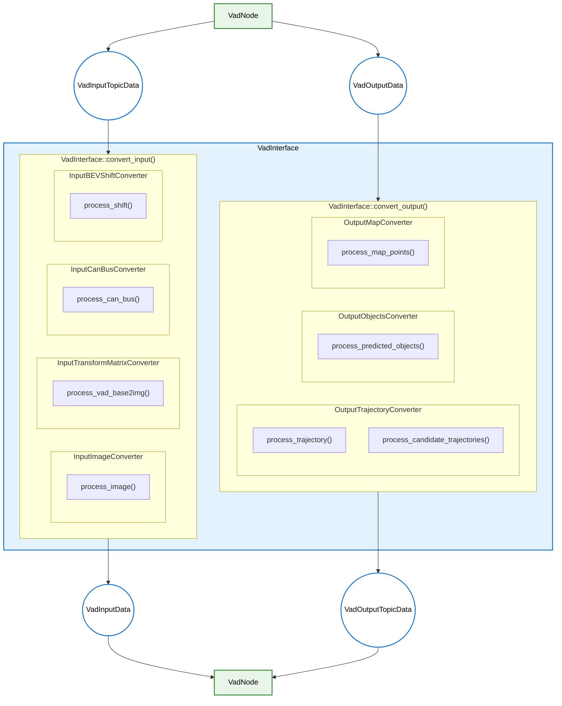

# VadInterface Design

- code: [vad_interface.cpp](../lib/vad_interface.cpp) [vad_interface.hpp](../src/vad_interface.hpp)

## Responsibilities

- Convert from `VadInputTopicData` to `VadInputData`, and from `VadOutputData` to `VadOutputTopicData`
  - Manage TF lookups via [`CoordinateTransformer`](../src/coordinate_transformer.hpp)
    - Provides camera frame transformations (base_link → camera frames) via TF buffer
    - Note: For CARLA, VAD coordinates = Autoware base_link coordinates (no conversion needed)
  - Convert input data (all converters in `vad_interface::` namespace)
    - Convert input images by [`InputImageConverter`](../src/input_converter/image_converter.hpp)
    - Convert input transform matrix by [`InputTransformMatrixConverter`](../src/input_converter/transform_matrix_converter.hpp)
      - Uses `CoordinateTransformer::lookup_base2cam()` to build transformation matrices
    - Convert input odometry data by [`InputCanBusConverter`](../src/input_converter/can_bus_converter.hpp)
    - Compute BEV shift by [`InputBEVShiftConverter`](../src/input_converter/bev_shift_converter.hpp)
  - Convert output data (all converters in `vad_interface::` namespace)
    - Convert output planning trajectory by [`OutputTrajectoryConverter`](../src/output_converter/trajectory_converter.hpp)
    - Convert output predicted objects by [`OutputObjectsConverter`](../src/output_converter/objects_converter.hpp)
    - Convert output map markers by [`OutputMapConverter`](../src/output_converter/map_converter.hpp)

- Responsible for preprocessing and postprocessing that use only CPU (does not use CUDA)
- Caches `vad_base2img` transformation matrix after first successful computation to avoid repeated TF lookups

## Processing Flowchart

### Function Roles

### API functions (public)

`VadNode` calls `convert_input()` before inference and `convert_output()` after inference.

- [`convert_input(const VadInputTopicData&)`](../lib/vad_interface.cpp): Convert from `VadInputTopicData` to `VadInputData`
  - Validates and caches `vad_base2img` transformation via [`InputTransformMatrixConverter::process_vad_base2img()`](../src/input_converter/transform_matrix_converter.hpp)
  - Processes CAN-bus data via [`InputCanBusConverter::process_can_bus()`](../src/input_converter/can_bus_converter.hpp)
  - Computes BEV shift via [`InputBEVShiftConverter::process_shift()`](../src/input_converter/bev_shift_converter.hpp)
  - Processes images via [`InputImageConverter::process_image()`](../src/input_converter/image_converter.hpp)
  - Updates `prev_can_bus_` for next frame

- [`convert_output(const VadOutputData&, ...)`](../lib/vad_interface.cpp): Convert from `VadOutputData` to `VadOutputTopicData`
  - Converts candidate trajectories via [`OutputTrajectoryConverter::process_candidate_trajectories()`](../src/output_converter/trajectory_converter.hpp)
  - Converts main trajectory via [`OutputTrajectoryConverter::process_trajectory()`](../src/output_converter/trajectory_converter.hpp)
  - Converts map polylines via [`OutputMapConverter::process_map_points()`](../src/output_converter/map_converter.hpp)
  - Converts predicted objects via [`OutputObjectsConverter::process_predicted_objects()`](../src/output_converter/objects_converter.hpp)

### Converter Architecture

All converter classes are in the `autoware::tensorrt_vad::vad_interface::` namespace and inherit from a base `Converter` class that provides access to `CoordinateTransformer` and configuration.

## Key Design Details

### CoordinateTransformer

- Wraps TF buffer and provides `lookup_base2cam(frame_id)` for camera transformations
- For CARLA: VAD coordinates are identical to Autoware base_link (no coordinate conversion)
- Used by `InputTransformMatrixConverter` to build `vad_base2img` matrices

### Caching Strategy

- `vad_base2img_transform_` is cached after first successful computation
- Validates transformation (checks for non-zero values) before caching
- Avoids repeated TF lookups on every frame

### Converter Dependency Injection

- All converters receive `CoordinateTransformer` reference and config in constructor
- Enables unit testing and separation of concerns

## TODO

- The name "CanBus" is used even though data is not obtained from CAN BUS. This naming convention prioritizes conformity with [the notation used in VAD code](https://github.com/hustvl/VAD/blob/36047b6b5985e01832d8a2ecb0355d7f3c753ee1/projects/mmdet3d_plugin/datasets/nuscenes_vad_dataset.py#L1375-L1382). However, this could cause confusion, so a better name should be considered.
