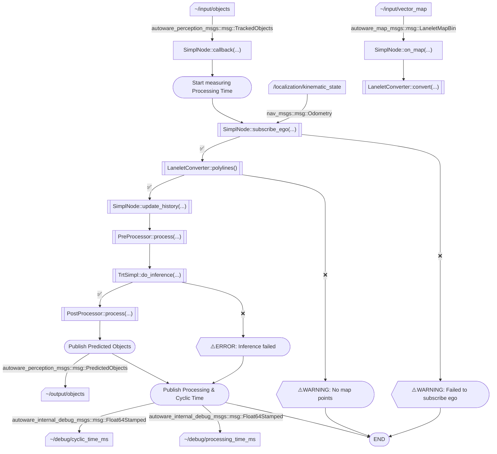

# autoware_simpl_prediction

## Purpose

The `autoware_simpl_prediction` is used for 3D object motion prediction based on ML-based model called SIMPL.

## Inner-workings / Algorithms

The implementation bases on SIMPL [1] [2] work. It uses TensorRT library for data process and network interface.

Workflow overview of this node is as follows:



### Inputs Representation

- $X_A\in R^{N\times D_{agent}\times T_{past}}$: Agent histories input.
- $X_M\in R^{K\times P\times D_{map}}$: Map points input.
- $X_{RPE}\in R^{(N+K)\times (N+K)\times D_{rpe}}$: Relative pose encoding input.

### Outputs Representation

- $P_{score}\in R^{N\times M}$: Predicted scores for each agent and mode.
- $P_{trajectory}\in R^{N\times M\times T_{future}\times D_{trajectory}}$: Predicted trajectories for each agent and mode.
  - Where, $D_{trajectory}$ is $(x, y, v_x, v_y)$ in the agent local coordinate frame.

## Inputs / Outputs

### Inputs

| Name                            | Type                                            | Description           |
| ------------------------------- | ----------------------------------------------- | --------------------- |
| `~/input/objects`               | `autoware_perception_msgs::msg::TrackedObjects` | Input tracked agents. |
| `~/input/vector_map`            | `autoware_map_msgs::msg::LaneletMapBin`         | Input vector map.     |
| `/localization/kinematic_state` | `nav_msgs::msg::Odometry`                       | Ego vehicle odometry. |

### Outputs

| Name               | Type                                              | Description               |
| ------------------ | ------------------------------------------------- | ------------------------- |
| `~/output/objects` | `autoware_perception_msgs::msg::PredictedObjects` | Predicted agents' motion. |

### Debug Outputs

| Name                         | Type                                                | Description           |
| ---------------------------- | --------------------------------------------------- | --------------------- |
| `~/debug/cyclic_time_ms`     | `autoware_internal_debug_msgs::msg::Float64Stamped` | Cyclic time [ms].     |
| `~/debug/processing_time_ms` | `autoware_internal_debug_msgs::msg::Float64Stamped` | Processing time [ms]. |

## Parameters

{{ json_to_markdown("perception/autoware_simpl/schema/simpl.scheme.json") }}

## [WIP] Model Training / Deployment

Now we are preparing a library to train and deploy SIMPL and other ML models featuring motion prediction tasks.

## Testing

Unit tests are provided and can be run with:

```shell
colcon test --packages-select autoware_simpl
colcon test-result --all
```

To print the test's details with while the tests are being run, use the `--event-handlers console_cohesion+` option to print the details directly to the console:

```shell
colcon test --event-handlers console_cohesion+ --packages-select autoware_simpl
```

## Assumptions / Known limits

### Agent to be Published

Note that only agents whose label is contained in `preprocess.labels` will be published.

For example, if `preprocess.labels` is set to `["VEHICLE", "PEDESTRIAN"]`, only agents with labels "ObjectClassification.CAR" and "ObjectClassification.PEDESTRIAN" will be published.

Here is the table of Autoware labels and their corresponding labels:

| Autoware Label                     | Correspondence  |
| ---------------------------------- | --------------- |
| `ObjectClassification::CAR`        | `VEHICLE`       |
| `ObjectClassification::PEDESTRIAN` | `PEDESTRIAN`    |
| `ObjectClassification::BICYCLE`    | `CYCLIST`       |
| `ObjectClassification::MOTORCYCLE` | `MOTORCYCLIST`  |
| `ObjectClassification::TRUCK`      | `LARGE_VEHICLE` |
| `ObjectClassification::TRAILER`    | `LARGE_VEHICLE` |
| `ObjectClassification::BUS`        | `LARGE_VEHICLE` |
| `ObjectClassification::UNKNOWN`    | `UNKNOWN`       |

### Maximum Number of Predictable Agents

We have not supported the dynamic shape inference yet. Therefore, the number of predicted agents must be fixed as `preprocess.max_num_agent` ($N$).
This value is determined when exporting ONNX.

Note that the following parameters are also determined when exporting ONNX:

- `preprocess.num_past`: $T_{past}$
- `preprocess.max_num_polyline`: $K$
- `preprocess.max_num_point`: $P$
- `postprocess.num_mode`: $M$
- `postprocess.num_future`: $T_{future}$

### Agent History Lifetime

Under the hood, `SimplNode` stores and accumulates agent history in every callback, but removes the history that is not observed in callbacks.

### Reliability of Predicted Paths

Predicted paths with a confidence score lower than `postprocess.score_threshold` are filtered out and not published.
**If all predicted modes for an object are filtered out, the published object will contain no path**.

Note that the total confidence of the remaining predicted paths is **not guaranteed to sum to 100%** after this filtering process.

## References / External Links

[1] Lu Zhang, Peiliang Li, Sikang Liu, and Shaojie Shen, "SIMPL: A Simple and Efficient Multi-agent Motion Prediction Baseline for Autonomous Driving", arXiv preprint arXiv:2402.02519 (2024). <!-- cspell:disable-line -->

[2] <https://github.com/HKUST-Aerial-Robotics/SIMPL>
