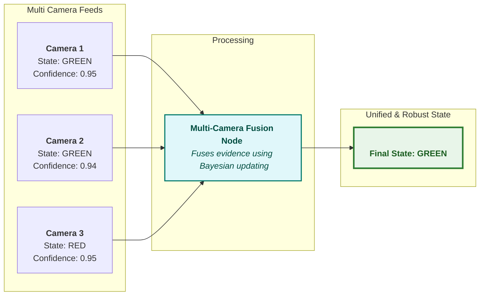
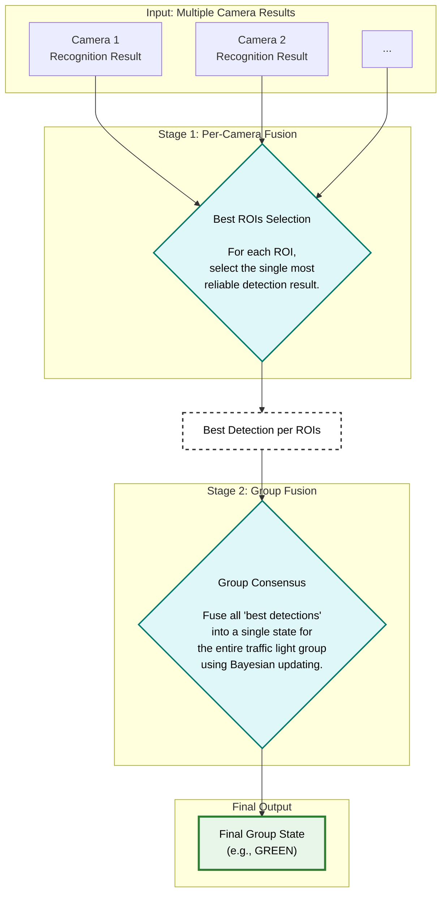

# autoware_traffic_light_multi_camera_fusion

## Overview

This node fuses traffic light recognition results from multiple cameras to produce a single, reliable traffic light state. By integrating information from different viewpoints and ROIs, it ensures robust performance even in challenging scenarios, such as partial **occlusions** or recognition errors from an individual camera.

---

## How It Works

The fusion algorithm operates in two main stages.

### Stage 1: Best View Selection (Per-Camera Fusion)

First, for each individual ROIs, the node selects the single most reliable detection—the "best shot"—from all available camera views.

This selection is based on a strict priority queue:

- **Latest Timestamp:** Detections with the most recent timestamp are prioritized for the same sensor.
- **Known State:** Results with a known color (Red, Green, etc.) are prioritized over 'Unknown'.
- **Full Visibility:** Detections from non-truncated ROIs (fully visible ROIs) are prioritized.
- **Highest Confidence:** The result with the highest detection confidence score is prioritized.

This process yields the single most plausible recognition for every ROIs.

### Stage 2: Group Consensus (Bayesian Fusion)

Next, the "best shot" detections from Stage 1 are fused to determine a single, coherent state for the entire traffic light group. Instead of simple voting or averaging, this node employs a more principled method: **Bayesian updating**.

- **Belief Score:** Each color (Red, Green, Yellow) maintains a "belief score" represented in **log-odds** for numerical stability and ease of updating.
- **Evidence Update:** Each selected detection from Stage 1 is treated as a piece of "evidence." Its confidence score is converted into a log-odds value representing the strength of that evidence.
- **Score Accumulation:** This evidence is **added** to the corresponding color's belief score.
- **Final Decision:** After accumulating all evidence, the color with the highest final score is chosen as the definitive state for the group.

## Input topics

For every camera, the following three topics are subscribed:

| Name                                                  | Type                                             | Description                           |
| ----------------------------------------------------- | ------------------------------------------------ | ------------------------------------- |
| `~/<camera_namespace>/camera_info`                    | sensor_msgs::msg::CameraInfo                     | camera info from map_based_detector   |
| `~/<camera_namespace>/detection/rois`                 | tier4_perception_msgs::msg::TrafficLightRoiArray | detection roi from fine_detector      |
| `~/<camera_namespace>/classification/traffic_signals` | tier4_perception_msgs::msg::TrafficLightArray    | classification result from classifier |

You don't need to configure these topics manually. Just provide the `camera_namespaces` parameter and the node will automatically extract the `<camera_namespace>` and create the subscribers.

## Output topics

| Name                       | Type                                                  | Description                        |
| -------------------------- | ----------------------------------------------------- | ---------------------------------- |
| `~/output/traffic_signals` | autoware_perception_msgs::msg::TrafficLightGroupArray | traffic light signal fusion result |

## Node parameters

{{ json_to_markdown("perception/autoware_traffic_light_multi_camera_fusion/schema/traffic_light_multi_camera_fusion.schema.json") }}
