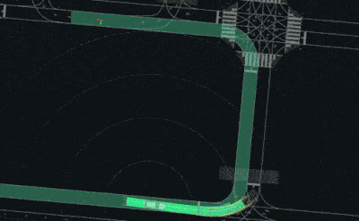
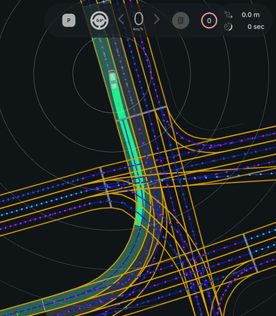
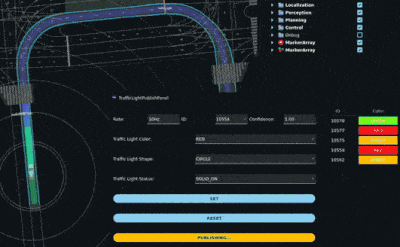

# Autoware Diffusion Planner

## Overview

The **Autoware Diffusion Planner** is a trajectory generation module for autonomous vehicles, designed to work within the [Autoware](https://autoware.org/) ecosystem. It leverages the [Diffusion Planner](https://github.com/ZhengYinan-AIR/Diffusion-Planner) model, as described in the paper ["Diffusion-Based Planning for Autonomous Driving with Flexible Guidance"](https://arxiv.org/abs/2501.15564) by Zheng et al. <!-- cSpell:ignore Zheng -->

This planner generates smooth, feasible, and safe trajectories by considering:

- Dynamic and static obstacles
- Vehicle kinematics
- User-defined constraints
- Lanelet2 map context
- Traffic signals and speed limits

It is implemented as a ROS 2 component node, making it easy to integrate into Autoware-based stacks. The node is aimed at working within the proposed [Autoware new planning framework](https://github.com/tier4/new_planning_framework).

---

## Features

- **Diffusion-based trajectory generation** for flexible and robust planning

  [](media/diffusion_planner.gif)

- **Integration with Lanelet2 maps** for lane-level context

  [](media/lanelet_map_integration.png)

- **Dynamic and static obstacle handling** using perception inputs

  [](media/diffusion_planner_reacts_to_bus.gif)

  [](media/reaction_to_other_agents.gif)

- **Traffic signal and speed limit awareness**

  [](media/traffic_light_support.gif)

- **ONNX Runtime** inference for fast neural network execution
- **ROS 2 publishers** for planned trajectories, predicted objects, and debug markers

---

## Parameters

{{ json_to_markdown("planning/autoware_diffusion_planner/schema/diffusion_planner.schema.json") }}

Parameters can be set via YAML (see `config/diffusion_planner.param.yaml`).

---

## Inputs

| Topic                     | Message Type                                        | Description              |
| ------------------------- | --------------------------------------------------- | ------------------------ |
| `~/input/odometry`        | nav_msgs/msg/Odometry                               | Ego vehicle odometry     |
| `~/input/acceleration`    | geometry_msgs/msg/AccelWithCovarianceStamped        | Ego acceleration         |
| `~/input/tracked_objects` | autoware_perception_msgs/msg/TrackedObjects         | Detected dynamic objects |
| `~/input/traffic_signals` | autoware_perception_msgs/msg/TrafficLightGroupArray | Traffic light states     |
| `~/input/vector_map`      | autoware_map_msgs/msg/LaneletMapBin                 | Lanelet2 map             |
| `~/input/route`           | autoware_planning_msgs/msg/LaneletRoute             | Route information        |

## Outputs

| Topic                        | Message Type                                              | Description                                |
| ---------------------------- | --------------------------------------------------------- | ------------------------------------------ |
| `~/output/trajectory`        | autoware_planning_msgs/msg/Trajectory                     | Planned trajectory for the ego vehicle     |
| `~/output/trajectories`      | autoware_internal_planning_msgs/msg/CandidateTrajectories | Multiple candidate trajectories            |
| `~/output/predicted_objects` | autoware_perception_msgs/msg/PredictedObjects             | Predicted future states of dynamic objects |
| `~/debug/lane_marker`        | visualization_msgs/msg/MarkerArray                        | Lane debug markers                         |
| `~/debug/route_marker`       | visualization_msgs/msg/MarkerArray                        | Route debug markers                        |

---

## Testing

Unit tests are provided and can be run with:

```bash
colcon test --packages-select autoware_diffusion_planner
colcon test-result --all
```

---

## ❗ Limitations

While the Diffusion Planner shows promising capabilities, there are several limitations to be aware of:

- **Route Termination**:
  The route input to the model consists of a sequence of preferred lanelets from the current position to the goal region. However, **this route does not necessarily end exactly at the goal position**. As a result, the ego vehicle **may continue driving past the goal** instead of stopping at the target location.

- **Training Dataset Domain Gap**:
  The provided diffusion model checkpoint was trained on datasets using a **proprietary Lanelet2 map that is not publicly available**. Consequently, **performance may significantly degrade when running on other maps**, especially in environments with different topology or tagging conventions.

- **Route Adherence & Lane Changing**:
  The model sometimes **fails to strictly follow the preferred lanelet route**. If the ego vehicle leaves the preferred lane (e.g., to avoid an obstacle), it tends to **only return to the route during curves**. It **seldom performs deliberate lane changes** to merge back into the correct route on straight segments.

- **Agent and Obstacle Avoidance**:
  Although the planner **reacts to other agents and can perform avoidance maneuvers**, this behavior is **not fully reliable**. In some cases, **collisions with static or dynamic obstacles may still occur** due to ignored agents or insufficient context comprehension.

- **Lack of Static Object Context**:
  Static environment context such as **traffic cones, guard rails, or construction barriers** is **not currently provided to the model**. Instead, an **empty tensor** is passed in their place, which can lead to **limited understanding of occlusions or drivable boundaries**.

---

## Development & Contribution

- Follow the [Autoware coding guidelines](https://autowarefoundation.github.io/autoware-documentation/main/contributing/).
- Contributions, bug reports, and feature requests are welcome via GitHub issues and pull requests.

---

## References

- [Diffusion Planner (original repo)](https://github.com/ZhengYinan-AIR/Diffusion-Planner)
- [Diffusion planner (our fork of the previous repo, used to train the model)](https://github.com/tier4/Diffusion-Planner)
- ["Diffusion-Based Planning for Autonomous Driving with Flexible Guidance"](https://arxiv.org/abs/2309.00615)

---

## License

This package is released under the Apache 2.0 License.
