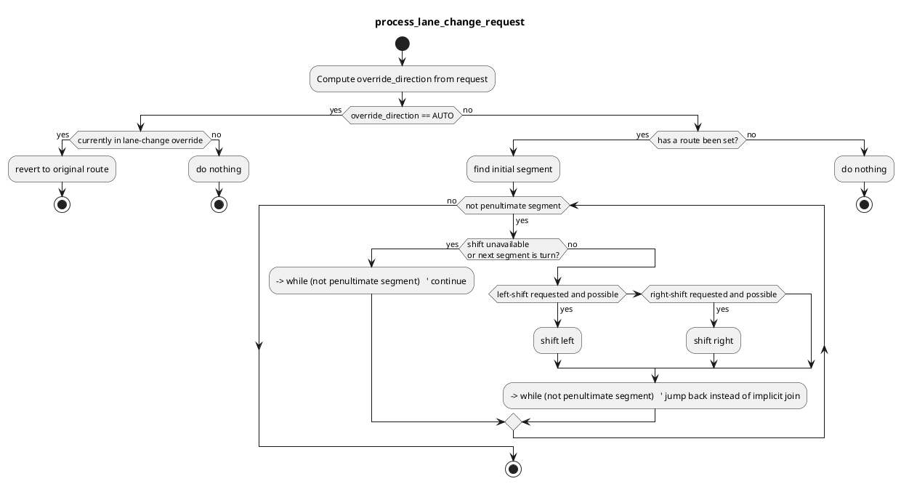

# Manual Lane Change Handler

## Purpose

`Manual Lane Change Handler` helps shift the preferred-primitives of a route to the left or right. A manual lane-change handler rviz plugin is also available for use for the user.

### Example for using the Manual Lane Change Handler

Service call to shift the preferred-lanes to the left

```bash
ros2 service call /planning/mission_planning/manual_lane_change_handler/set_preferred_lane tier4_external_api_msgs/srv/SetPreferredLane lane_change_direction:\ 0\
```

### Services

| Name                                                                                 | Type                                         | Description            |
| ------------------------------------------------------------------------------------ | -------------------------------------------- | ---------------------- |
| `/planning/manual_lane_change_handler/manual_lane_change_handler/set_preferred_lane` | tier4_external_api_msgs/srv/SetPreferredLane | preferred-lane request |

### Subscriptions

| Name                               | Type                                    | Description           |
| ---------------------------------- | --------------------------------------- | --------------------- |
| `input/odometry`                   | nav_msgs/msg/Odometry                   | vehicle odometry      |
| `/planning/mission_planning/route` | autoware_planning_msgs/msg/LaneletRoute | current lanelet route |

### Publications

| Name                         | Type                                            | Description                               |
| ---------------------------- | ----------------------------------------------- | ----------------------------------------- |
| `~/debug/processing_time_ms` | autoware_internal_debug_msgs/msg/Float64Stamped | processing time for lane change for debug |
| `~/debug/route_marker`       | visualization_msgs/msg/MarkerArray              | route marker for debug                    |
| `~/debug/goal_footprint`     | visualization_msgs/msg/MarkerArray              | goal footprint for debug                  |

## Service client

| Service Name         | Description                           |
| -------------------- | ------------------------------------- |
| ~/set_preferred_lane | The service to set the preferred lane |

## Registered Servers

| Service Name                                                       | Description                                |
| ------------------------------------------------------------------ | ------------------------------------------ |
| /planning/mission_planning/mission_planner/set_preferred_primitive | The service to set the preferred primitive |

### Setting Preferred Lane

This service allows for shifting the current preferred lane to the left or right, or reverting to the default preferred lane received from the route planner.
As the vehicle moves, the shifting is done relative to the current preferred lane.

Based on certain criteria, shifting may be rejected, as in the following cases:

1. Left or Right shift is not available due to no lane being present to shift to
2. The next segment is a turn or the very last lane - this is to ensure that we can navigate the enter path and end up at the goal


