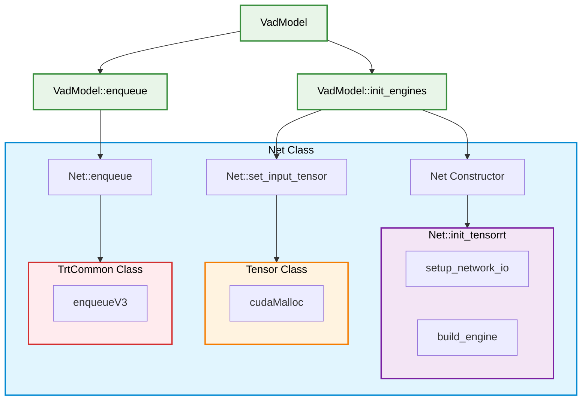
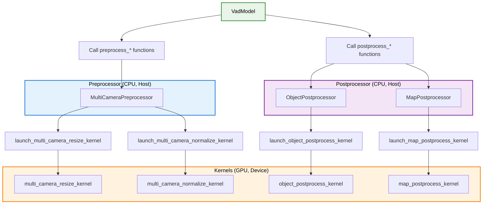

# VadModel Design

- code: [vad_model.hpp](../src/vad_model.hpp)

## Responsibilities

- Responsible for CUDA-based processing and TensorRT inference
- Receives `VadInputData`, executes inference, and returns `VadOutputData`
- Preprocesses multi-camera images using CUDA via `MultiCameraPreprocessor`
- Manages two-stage inference: backbone network and head network (with/without prev_bev)
- Transfers data between Host (CPU) and Device (GPU) using `Tensor` class
- Post-processes outputs using CUDA:
  - Object detection via `ObjectPostprocessor`
  - Map polylines via `MapPostprocessor`
- Manages prev_bev features across frames for temporal context
- Dynamically loads/unloads networks (releases `head_no_prev` after first frame)

## Processing Flowchart

```mermaid
flowchart TD
    Start([VadNode calls VadModel::infer]) --> VadInputDataBox((VadInputData))
    VadInputDataBox --> LoadInputs

    subgraph InferScope["VadModel::infer()"]
        LoadInputs[load_inputs: Preprocess input data and transfer from CPU to GPU]
        LoadInputs --> Enqueue[enqueue: Execute TensorRT inference]
        Enqueue --> SavePrevBev[save_prev_bev: Transfer prev_bev from GPU to CPU for next frame]
        SavePrevBev --> Postprocess[postprocess: Postprocess output and transfer from GPU to CPU]

        Postprocess --> CheckFirstFrame{Is first frame?}

        CheckFirstFrame -->|Yes| ReleaseNetwork[release_network: Release first-frame-only ONNX]
        ReleaseNetwork --> LoadHead[load_head: Load head ONNX that uses previous frame's BEV features]
        LoadHead --> ReturnText[return]

        CheckFirstFrame -->|No| ReturnText
    end

    ReturnText --> VadOutputDataBox((VadOutputData))



    style InferScope fill:#e1f5fe,stroke:#0288d1,stroke-width:2px,color:#000000
    style CheckFirstFrame fill:#fff3e0,stroke:#f57c00,stroke-width:2px,color:#000000
    style ReleaseNetwork fill:#ffebee,stroke:#d32f2f,stroke-width:2px,color:#000000
    style LoadHead fill:#e8f5e8,stroke:#388e3c,stroke-width:2px,color:#000000

    %% Links to source code files
    click Start "https://github.com/autowarefoundation/autoware_universe/tree/main/planning/autoware_tensorrt_v../src/vad_node.hpp" "VadNode header file"
    click VadInputDataBox "https://github.com/autowarefoundation/autoware_universe/tree/main/planning/autoware_tensorrt_v../src/data_types.hpp" "VadInputData definition"
    click LoadInputs "https://github.com/autowarefoundation/autoware_universe/tree/main/planning/autoware_tensorrt_v../src/vad_model.hpp" "VadModel implementation"
    click Enqueue "https://github.com/autowarefoundation/autoware_universe/tree/main/planning/autoware_tensorrt_v../src/vad_model.hpp" "VadModel implementation"
    click SavePrevBev "https://github.com/autowarefoundation/autoware_universe/tree/main/planning/autoware_tensorrt_v../src/vad_model.hpp" "VadModel implementation"
    click Postprocess "https://github.com/autowarefoundation/autoware_universe/tree/main/planning/autoware_tensorrt_v../src/vad_model.hpp" "VadModel implementation"
    click ReleaseNetwork "https://github.com/autowarefoundation/autoware_universe/tree/main/planning/autoware_tensorrt_v../src/vad_model.hpp" "VadModel implementation"
    click LoadHead "https://github.com/autowarefoundation/autoware_universe/tree/main/planning/autoware_tensorrt_v../src/vad_model.hpp" "VadModel implementation"
    click VadOutputDataBox "https://github.com/autowarefoundation/autoware_universe/tree/main/planning/autoware_tensorrt_v../src/data_types.hpp" "VadOutputData definition"
```

### Function Roles

### API functions (public)

- [`infer(const VadInputData&)`](../src/vad_model.hpp): Main inference pipeline
  1. Selects head network (`head_no_prev` for first frame, `head` for subsequent frames)
  2. Calls `load_inputs()` to preprocess and transfer data to GPU
  3. Calls `enqueue()` to execute backbone and head networks
  4. Calls `save_prev_bev()` to preserve BEV features for next frame
  5. Calls `postprocess()` to extract outputs and transfer to CPU
  6. On first frame: releases `head_no_prev` network and calls `load_head()` to initialize `head` network
  7. Returns `VadOutputData` containing trajectories, objects, and map polylines

### Internal functions (private)

- [`init_engines()`](../src/vad_model.hpp): Initializes TensorRT networks at construction
  - Creates `Backbone`, `Head`, and `Head_no_prev` network instances
  - Sets up external input bindings for memory sharing between networks
  - Logs binding connections between networks

- [`load_inputs()`](../src/vad_model.hpp): Prepares inputs for inference
  - Preprocesses multi-camera images using `MultiCameraPreprocessor::preprocess_images()`
  - Loads metadata: `shift`, `vad_base2img` (lidar2img), `can_bus`
  - Sets `prev_bev` binding for `head` network (not needed for `head_no_prev`)

- [`enqueue()`](../src/vad_model.hpp): Executes inference
  - Enqueues backbone network
  - Enqueues selected head network
  - Synchronizes CUDA stream to wait for completion

- [`save_prev_bev()`](../src/vad_model.hpp): Preserves BEV features for next frame
  - Copies `out.bev_embed` from head output to `prev_bev` tensor
  - Uses `cudaMemcpyAsync` Device-to-Device transfer
  - Returns shared pointer to `Tensor` stored in `saved_prev_bev_` member

- [`postprocess()`](../src/vad_model.hpp): Extracts and processes outputs
  - Retrieves `out.ego_fut_preds` (trajectory predictions) from GPU
  - Processes detected objects via `ObjectPostprocessor::postprocess_objects()`
  - Processes map polylines via `MapPostprocessor::postprocess_map_preds()`
  - Performs cumulative sum on trajectory points to convert deltas to absolute positions
  - Extracts trajectories for all commands and the selected command
  - Returns `VadOutputData` with all processed outputs

- [`release_network()`](../src/vad_model.hpp): Frees network resources
  - Clears bindings map
  - Resets and erases network from `nets_` map
  - Called to release `head_no_prev` after first frame

- [`load_head()`](../src/vad_model.hpp): Initializes head network with prev_bev support
  - VAD requires previous frame's BEV features as input
  - First frame uses `head_no_prev` (no previous BEV available)
  - After first frame, switches to `head` which uses `prev_bev` from previous inference
  - Sets up external bindings to connect with backbone outputs

### Design concepts

#### Logger Pattern

- **Goal**: `VadModel` should not depend on ROS, but needs logging capabilities
- **Solution**: Template-based dependency injection with abstract logger interface
- [`VadLogger`](../src/ros_vad_logger.hpp): Abstract base class defining logging interface
- [`RosVadLogger`](../src/ros_vad_logger.hpp): Concrete implementation using ROS 2 logging macros (`RCLCPP_INFO_THROTTLE`, etc.)
- `VadModel<LoggerType>`: Template class parameterized by logger type
  - Enforces `LoggerType` must inherit from `VadLogger` via `static_assert`
  - Enables unit testing with mock loggers
  - Maintains consistent logging behavior across ROS and CUDA domains
- **Trade-off**: Template implementation requires all code in header file (`.hpp`), following C++ template constraints

#### Network Architecture

- Each ONNX file corresponds to one `Net` class
- `Net` class uses [`autoware_tensorrt_common`](../../../perception/autoware_tensorrt_common/README.md) to build and execute TensorRT engines
- Three network types:
  1. **Backbone**: Processes multi-camera images and extracts features
  2. **Head_no_prev**: First-frame head without previous BEV features
  3. **Head**: Subsequent-frame head using `prev_bev` from previous inference
- Memory management via [`Tensor`](../src/networks/tensor.hpp) class
  - Handles `cudaMalloc` for GPU memory allocation
  - Handles `cudaMemcpyAsync` for Host↔Device transfers
- Bindings sharing: Outputs from one network can be directly used as inputs to another (e.g., backbone outputs → head inputs)

##### Network classes: API functions

- **Constructor** → [`init_tensorrt`](../src/networks/net.hpp)
  - Called from `VadModel::init_engines` during model initialization
  - **setup_network_io**: Implemented differently in [`Backbone`](../src/networks/backbone.hpp) and [`Head`](../src/networks/head.hpp)
    - Defines input/output tensor names, shapes, and data types
  - **build_engine**: Creates TensorRT engine
    - Instantiates [`TrtCommon`](../../../perception/autoware_tensorrt_common/include/autoware/tensorrt_common/tensorrt_common.hpp) for engine management
    - Instantiates [`NetworkIO`](../../../perception/autoware_tensorrt_common/include/autoware/tensorrt_common/utils.hpp) for I/O configuration
    - Builds engine from ONNX file or loads from cache

- **set_input_tensor**: Called from `VadModel::init_engines` and `VadModel::load_head`
  - Accepts map of external bindings (tensors from other networks)
  - Allocates GPU memory for new tensors via [`Tensor`](../lib/networks/tensor.cpp) constructor
  - Sets up memory sharing for external inputs (avoids redundant copies)

- **enqueue**: Called from `VadModel::enqueue`
  - Executes TensorRT inference via [`TrtCommon::enqueueV3`](../../../perception/autoware_tensorrt_common/include/autoware/tensorrt_common/tensorrt_common.hpp)
  - Runs asynchronously on CUDA stream
  - Note: Uses `enqueueV3` for current TensorRT version; update if TensorRT API changes

#### CUDA Preprocessor and Postprocessor Architecture

Preprocessor and Postprocessor classes wrap CUDA kernels and provide clean C++ interfaces to `VadModel`.

**Preprocessor/Postprocessor Classes** (CPU-side wrappers):

- [`MultiCameraPreprocessor`](../src/networks/preprocess/multi_camera_preprocess.hpp): Multi-camera image preprocessing
- [`ObjectPostprocessor`](../src/networks/postprocess/object_postprocess.hpp): 3D object detection postprocessing
- [`MapPostprocessor`](../src/networks/postprocess/map_postprocess.hpp): Map polyline postprocessing

**Processing Flow**:

1. `VadModel` calls `preprocess_*()` or `postprocess_*()` methods
2. These methods call `launch_*_kernel()` functions
3. Kernel launch functions calculate CUDA grid/block dimensions
4. CUDA kernels execute on GPU

**CUDA Kernel Launch Functions**:

- [`launch_multi_camera_resize_kernel`](../lib/networks/preprocess/multi_camera_preprocess_kernel.cu): Resize images to target resolution
- [`launch_multi_camera_normalize_kernel`](../lib/networks/preprocess/multi_camera_preprocess_kernel.cu): Normalize pixel values
- [`launch_object_postprocess_kernel`](../lib/networks/postprocess/object_postprocess_kernel.cu): Filter and decode object detections
- [`launch_map_postprocess_kernel`](../lib/networks/postprocess/map_postprocess_kernel.cu): Decode map polylines

**Benefits**:

- Separation of concerns: C++ wrapper logic vs CUDA kernel logic
- Testability: Can mock pre-processors/post-processors
- Performance: Kernels optimized for parallel execution on GPU

## Key Design Details

### Two-Stage Network Loading

- **First Frame**: Uses `head_no_prev` (no temporal context required)
- **Subsequent Frames**: Uses `head` (incorporates `prev_bev` from previous frame)
- **Memory Optimization**: `head_no_prev` is released after first frame to free GPU memory

### Memory Management Strategy

- **Bindings Sharing**: Network outputs can be directly connected as inputs to other networks
- **Tensor Class**: Encapsulates CUDA memory operations (malloc, copy, free)
- **Saved BEV**: `prev_bev` is preserved on GPU between frames (Device-to-Device copy)

### Asynchronous Execution

- All CUDA operations use a single `cudaStream_t stream_` member
- Operations are asynchronous but synchronized before postprocessing
- Enables overlapping computation when possible

## TODO

- **Optimize prev_bev transfer**: Currently copies Device→Device; could keep as output binding to avoid copy
- **Quantization**: Currently uses FP32; INT8 quantization would improve speed and memory efficiency
- **Multi-stream execution**: Could pipeline backbone and head execution with multiple streams
