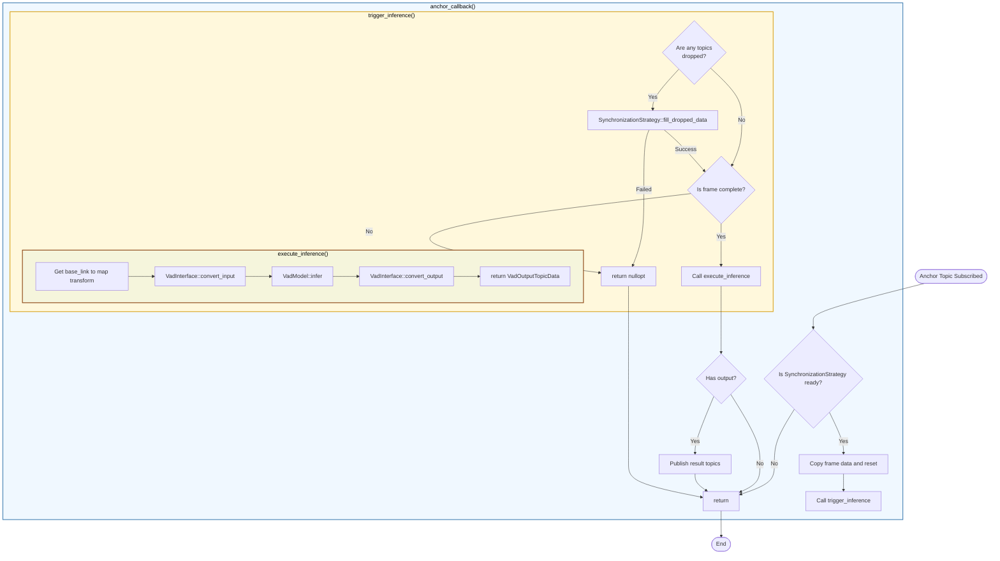

# VadNode Design

- code: [vad_node.cpp](../src/vad_node.cpp), [vad_node.hpp](../src/vad_node.hpp)

## Responsibilities

- Subscribe to ROS topics, execute callback functions, and pack data into `VadInputTopicData`
- Manage TF buffer and listen to `/tf_static` for camera transformations
- Use `SynchronizationStrategy` to check data readiness and handle dropped data
- Check if inference can be executed, execute inference, obtain `VadOutputTopicData`, and publish
- Read ROS parameters and create configs for `VadInterface` and `VadModel`
- Initialize VAD model and interface with proper configuration

## Processing Flowchart

- Synchronization checking and dropped data handling are managed by [`SynchronizationStrategy`](../src/synchronization_strategy.hpp).
  - Currently implements `FrontCriticalSynchronizationStrategy` which requires the front camera image
- Conversions between `VadInputTopicData` ↔ `VadInputData` and `VadOutputData` ↔ `VadOutputTopicData` are handled by [`VadInterface`](../src/vad_interface.hpp).

### Function Roles

- [`anchor_callback()`](../src/vad_node.cpp): Callback triggered when receiving the front camera image (anchor topic)
  - Uses `SynchronizationStrategy::is_ready()` to check if all required data is available
  - Copies frame data, resets accumulator, and calls `trigger_inference()`
- [`trigger_inference()`](../src/vad_node.cpp): Checks for dropped data, fills if necessary, and triggers inference
  - Uses `SynchronizationStrategy::is_dropped()` to detect missing data
  - Uses `SynchronizationStrategy::fill_dropped_data()` to handle dropped frames
  - Verifies frame completeness before calling `execute_inference()`
- [`execute_inference()`](../src/vad_node.cpp): Executes VAD inference pipeline
  - Retrieves base_link to map transformation
  - Calls `VadInterface::convert_input()` to convert `VadInputTopicData` → `VadInputData`
  - Calls `VadModel::infer()` to run inference and get `VadOutputData`
  - Calls `VadInterface::convert_output()` to convert `VadOutputData` → `VadOutputTopicData`
- [`publish()`](../src/vad_node.cpp): Publishes inference results to ROS topics
  - Publishes trajectory, candidate trajectories, predicted objects, and map markers
- [`initialize_vad_model()`](../src/vad_node.cpp): Initializes VadModel and VadInterface after node construction
  - Loads ROS parameters and creates configurations
  - Shares TF buffer with VadInterface for coordinate transformations

## TODO

- Excessive use of callbacks when subscribing can increase CPU usage. Use callbacks only when it's necessary to react to topic reception, otherwise use `Subscription->take()`.
- This class has many responsibilities: creating config from ROS parameters, creating publishers and subscribers, callback functions, triggering and executing inference, and publishing. If readability becomes poor, it should be split into separate classes by responsibility.
- Add [`SynchronizationStrategy`](../src/synchronization_strategy.hpp) other than FrontCritical
  - e.g. Consider synchronized when the front 3 images are available
