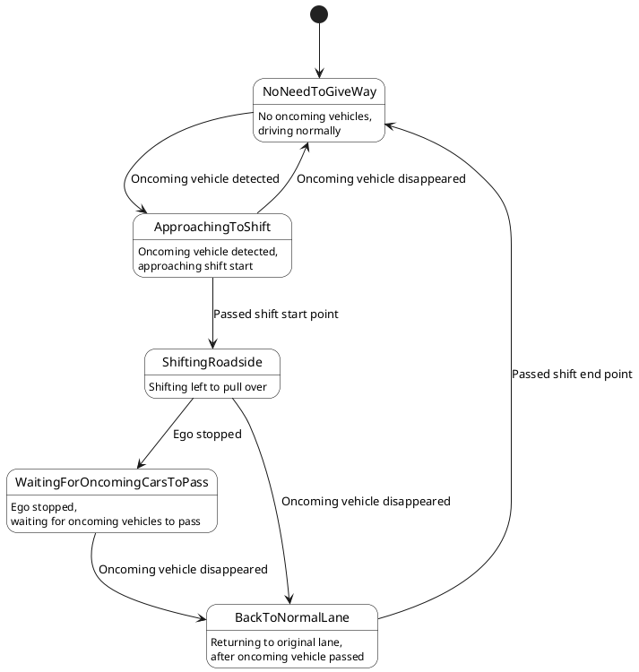
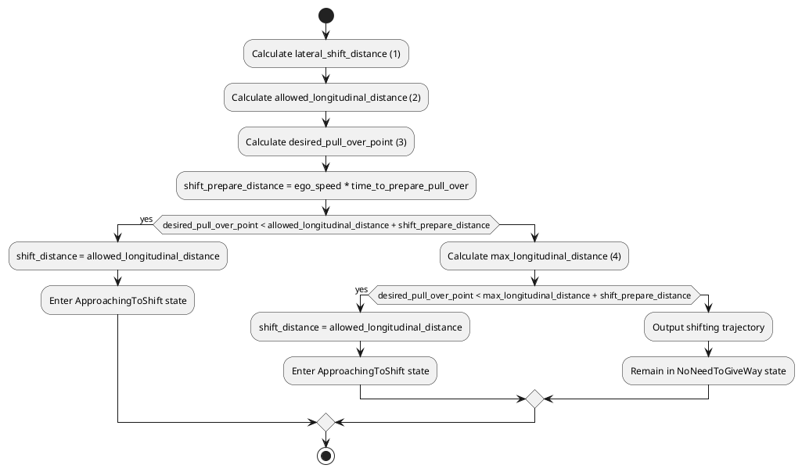

# Bidirectional Traffic

This module enables trajectory planning for vehicles on "single-lane bidirectional traffic" roads in autonomous driving systems. Here, "single-lane bidirectional traffic" refers to roads without a centerline, such as those commonly found in residential areas, as shown in the image below．

In the following descriptions, the term bidirectional traffic refers specifically to such single-lane bidirectional roads as shown in the image above.

## Purpose/Role

The main roles of this module are as follows:

- Generating a driving trajectory along the left (or right) side of the road center

  This module provides a function to generate a trajectory along the left (or right) side of the road center on bidirectional traffic lanes. In some countries, traffic laws require vehicles to drive on the left or right side of the road center on bidirectional roads. For example, in Japan, [Article 18, Paragraph 1 of the Road Traffic Act](https://laws.e-gov.go.jp/law/335AC0000000105#Mp-Ch_3-Se_1-At_18) requires that vehicles must keep to the left side of the road center. Because of these legal requirements, this module provides the function to generate a trajectory that follows the left (or right) side of the road center on bidirectional roads.

- Giving way to oncoming vehicles on bidirectional traffic roads

  This module provides the function for the ego vehicle to stop on the left side of the road and give way to oncoming vehicles in all situations where vehicles must pass each other on bidirectional roads. Bidirectional traffic roads are often narrow, and it is dangerous for both the ego vehicle and the oncoming vehicle to pass while moving simultaneously. To avoid such dangerous situations, this module enables the ego vehicle to stop on the left side of the road until the oncoming vehicle has completely passed.

## The representation of bidirectional traffic on a Lanelet map

Bidirectional lanelets are represented on a Lanelet map as two lanes with opposite directions that share the same LineString as their boundary. There is no need to assign any special tags to the lanelets.

## Limitations

This module does not support the following situations or functionalities.

- Handling situations where passing is not possible

  Depending on factors such as lane width, the size of the ego vehicle and the oncoming vehicle, and the surrounding environment, simple behaviors like those shown in the video above may not be sufficient for passing. In such cases, special behaviours such as reversing or clearing an intersection may be required. However, this module does not provide such functionality.

- When the oncoming vehicle is giving way or moving slowly

  In cases where the oncoming vehicle is trying to give way or is traveling at a low speed, it may be more appropriate for the ego vehicle to continue driving rather than stopping to give way. However, this module does not make any decision about whether to give way to the oncoming vehicle -- **it always pulls over to the left and stops.**

- Does not support the functionality of pulling into the shoulder to stop and give way

  Depending on the road width, the ego vehicle may need to enter the shoulder in order to give way to an oncoming vehicle. However, this module does not support such functionality.

## Inner workings/Algorithms

This module does not support the following situations or functionalities.

### Keep Left

This module detects bidirectional lanelets from the lanelet map and performs a keep left maneuver. When keeping left, the shift starts from the beginning of the lanelet immediately before the bidirectional lanelet, and ends at the end of the bidirectional lanelet.

### Give Way

#### State transition of GiveWay

To perform the give way maneuver, the GiveWay module has five internal states.

- **NoNeedToGiveWay**

  No oncoming vehicles present and driving normally or oncoming vehicles are far away.

  

- **ApproachingToShift**

  If an oncoming vehicle is detected, it generates a path to shift left and pull over, approaching the shift start point.

  

- **ShiftingRoadside**

  

- **WaitingForOncomingCarsToPass**

  The ego vehicle stops and waits until all oncoming vehicles have passed.

  

- **BackToNormalLane**

  After the oncoming vehicle has passed, the ego vehicle performs a shift to return to its original driving lane.

  

The state transition diagram of the GiveWay module is shown below.

#### How to decide shift length to pull over?

When an oncoming vehicle is detected, it is necessary to determine how much longitudinal distance to consume for the shift.

The figure above illustrates the distances related to lane shifting. The shift prepare distance is the distance required to prepare for shifting before reaching the shift start point, and it is calculated by multiplying the parameter time_to_prepare_pull_over by the ego_velocity.

These distances are calculated when the state is NoNeedToGiveWay. Once the ego vehicle enters the shift prepare distance, the state transitions to ApproachingToShift. When it enters the shift distance, the state transitions to ShiftingRoadside.

While in the NoNeedToGiveWay state, the calculation of the shift_distance and the corresponding state transitions are handled as follows.

We now provide a detailed explanation of the following four calculations:

##### 1. Calculate `lateral_shift_distance`

`lateral_shift_distance` is the lateral distance that the ego vehicle needs to shift. This value is calculated from `min_distance_from_roadside` and `shift_distance_to_pull_over_from_center_line`, based on `road_width` and `vehicle_width`, as follows:

$$
  \text{lateral_shift_distance} = \text{max}(\text{road_width} / 2 - \text{vehicle_width} / 2 - \text{min_distance_from_roadside}, \text{shift_distance_to_pull_over_from_center_line})
$$

##### 2. Calculate `allowed_longitudinal_distance`

`allowed_longitudinal_distance` is the minimum longitudinal distance required for the ego vehicle to perform the shift. Shifting in a shorter distance would require a sharp steering maneuver, which is unsafe. This distance is calculated such that the lateral jerk derived from `lateral_shift_distance` and `ego_velocity` does not exceed `max_lateral_jerk`:

$$
  \text{allowed_longitudinal_distance} = \text{calc_longitudinal_dist_from_jerk}(\text{lateral_shift_distance}, \text{max_lateral_jerk}, \text{ego_velocity})
$$

##### 3. Calculate `desired_pull_over_point`

If the shift starts too early, the ego vehicle may have to wait a long time for the oncoming vehicle to pass. If it starts too late, there is a risk of collision. To avoid both, the ideal point to begin the pull-over is calculated based on the ego speed and the oncoming vehicle's speed, assuming the ego vehicle will stop and wait for `wait_time_for_oncoming_car` seconds:

$$
  \text{desired_pull_over_point} = \frac{(\text{distance_to_oncoming_car} - \text{oncoming_car_speed} \cdot \text{wait_time_for_oncoming_car}) \cdot \text{ego_speed}}{\text{ego_speed} + \text{oncoming_car_speed}}
$$

##### 4. Calculate `max_longitudinal_distance`

An overly long shift distance may appear unnatural. To prevent this, the maximum longitudinal distance is calculated based on the minimum lateral jerk:

$$
  \text{max_longitudinal_distance} = \text{calc_longitudinal_dist_from_jerk}(\text{lateral_shift_distance}, \text{min_lateral_jerk}, \text{ego_velocity})
$$

## Parameters

{{ json_to_markdown("planning/behavior_path_planner/autoware_behavior_path_bidirectional_traffic_module/schema/bidirectional_traffic.schema.json") }}
