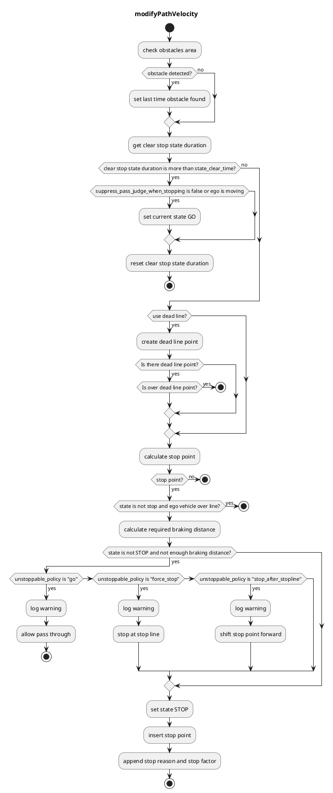

## Detection Area

### Role

If pointcloud or predicted objects are detected in a detection area defined on a map, the stop planning will be executed at the predetermined point.

### Activation Timing

This module is activated when there is a detection area on the target lane.

### Module Parameters

| Parameter                           | Type   | Description                                                                                                                                              |
| ----------------------------------- | ------ | -------------------------------------------------------------------------------------------------------------------------------------------------------- |
| `use_dead_line`                     | bool   | [-] weather to use dead line or not                                                                                                                      |
| `state_clear_time`                  | double | [s] when the vehicle is stopping for certain time without incoming obstacle, move to STOPPED state                                                       |
| `stop_margin`                       | double | [m] a margin that the vehicle tries to stop before stop_line                                                                                             |
| `dead_line_margin`                  | double | [m] ignore threshold that vehicle behind is collide with ego vehicle or not                                                                              |
| `unstoppable_policy`                | string | [-] policy for handling unstoppable situations: "go" (pass through), "force_stop" (emergency stop), or "stop_after_stopline" (stop after the stop line)  |
| `max_deceleration`                  | double | [m/s^2] maximum deceleration used to calculate required braking distance for unstoppable situation handling                                              |
| `delay_response_time`               | double | [s] delay response time used to calculate required braking distance for unstoppable situation handling                                                   |
| `hold_stop_margin_distance`         | double | [m] parameter for restart prevention (See Algorithm section)                                                                                             |
| `distance_to_judge_over_stop_line`  | double | [m] parameter for judging that the stop line has been crossed                                                                                            |
| `suppress_pass_judge_when_stopping` | bool   | [m] parameter for suppressing pass judge when stopping                                                                                                   |
| `enable_detected_obstacle_logging`  | bool   | [-] enable/disable logging of detected obstacle positions, time elapsed since last detection, and ego vehicle position when ego-vehicle is in STOP state |
| `target_filtering.pointcloud`       | bool   | [-] whether to stop for pointcloud detection                                                                                                             |
| `target_filtering.unknown`          | bool   | [-] whether to stop for UNKNOWN objects area                                                                                                             |
| `target_filtering.car`              | bool   | [-] whether to stop for CAR objects area                                                                                                                 |
| `target_filtering.truck`            | bool   | [-] whether to stop for TRUCK objects area                                                                                                               |
| `target_filtering.bus`              | bool   | [-] whether to stop for BUS objects area                                                                                                                 |
| `target_filtering.trailer`          | bool   | [-] whether to stop for TRAILER objects area                                                                                                             |
| `target_filtering.motorcycle`       | bool   | [-] whether to stop for MOTORCYCLE objects area                                                                                                          |
| `target_filtering.bicycle`          | bool   | [-] whether to stop for BICYCLE objects area                                                                                                             |
| `target_filtering.pedestrian`       | bool   | [-] whether to stop for PEDESTRIAN objects area                                                                                                          |
| `target_filtering.animal`           | bool   | [-] whether to stop for ANIMAL objects area                                                                                                              |
| `target_filtering.hazard`           | bool   | [-] whether to stop for HAZARD objects area                                                                                                              |
| `target_filtering.over_drivable`    | bool   | [-] whether to stop for OVER_DRIVABLE objects area                                                                                                       |
| `target_filtering.under_drivable`   | bool   | [-] whether to stop for UNDER_DRIVABLE objects area                                                                                                      |

### Inner-workings / Algorithm

1. Gets a detection area and stop line from map information and confirms if there are obstacles in the detection area
2. Inserts stop point l[m] in front of the stop line
3. Calculates required braking distance based on current velocity, `max_deceleration`, and `delay_response_time`
4. If the vehicle cannot stop before the stop line, applies the configured `unstoppable_policy`
5. Sets velocity as zero at the determined stop point

#### Detection Logic

The module uses two detection sources:

- **Pointcloud detection**: Detects any obstacles in the detection area using 3D point cloud data (if `target_filtering.pointcloud` is enabled)
- **Predicted objects detection**: Detects classified objects (vehicles, pedestrians, etc.) in the detection area based on perception module outputs

The module stops the vehicle if either detection source finds an obstacle. For performance optimization, if pointcloud detection finds an obstacle, predicted objects detection is skipped (short-circuit evaluation).

#### Flowchart

#### Restart prevention

If it needs X meters (e.g. 0.5 meters) to stop once the vehicle starts moving due to the poor vehicle control performance, the vehicle goes over the stopping position that should be strictly observed when the vehicle starts to moving in order to approach the near stop point (e.g. 0.3 meters away).

This module has parameter `hold_stop_margin_distance` in order to prevent from these redundant restart. If the vehicle is stopped within `hold_stop_margin_distance` meters from stop point of the module (\_front_to_stop_line < hold_stop_margin_distance), the module judges that the vehicle has already stopped for the module's stop point and plans to keep stopping current position even if the vehicle is stopped due to other factors.

<figure markdown>
  {width=1000}
  <figcaption>parameters</figcaption>
</figure>

<figure markdown>
  {width=1000}
  <figcaption>outside the hold_stop_margin_distance</figcaption>
</figure>

<figure markdown>
  {width=1000}
  <figcaption>inside the hold_stop_margin_distance</figcaption>
</figure>

#### Unstoppable situation handling

When the ego vehicle cannot stop before the stop line with the given `max_deceleration` and `delay_response_time`, the module applies the `unstoppable_policy`:

- **"go" policy**: The vehicle is allowed to pass through without stopping. A warning is logged.
- **"force_stop" policy**: The vehicle performs a stop at the original stop line, even if it cannot stop comfortably. A warning is logged.
- **"stop_after_stopline" policy**: The stop point is shifted forward beyond the stop line to ensure the vehicle can stop safely within the physical limits.

The required braking distance is calculated as: \(d*{req} = v \cdot t*{delay} + v^2/(2a*{max})\), where \(v\) is current velocity, \(t*{delay}\) is `delay_response_time`, and \(a\_{max}\) is `max_deceleration`.

For the "stop*after_stopline" policy, if \(d*{req}\) exceeds the remaining distance to the stop line \(d*{stop}\), the stop point is shifted forward by \(d*{req} - d\_{stop}\). This adjustment is applied only once, when the module transitions from GO to STOP state.
