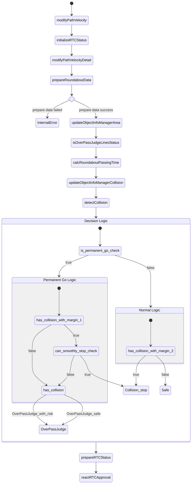

# Roundabout Behavior Velocity Module

## Role

This module is responsible for safely managing entry into roundabouts by performing collision checks against vehicles in the attention area just before entry. Currently, it is designed to work with single-lane roundabouts due to the complexity of multi-lane scenarios.

## Activation

- A module instance is launched on a lane that is an entry lanelet of a Roundabout regulatory element on the path.

## Requirements/Limitations

- The HDMap needs to have the roundabout regulatory element defined with correct lanelet topology (entry/exit/inner lanes).
- WIP(perception requirements/limitations)
- WIP(sensor visibility requirements/limitations)

## Attention area

The attention area for a roundabout is defined as the lanelets within the Roundabout regulatory element that conflict with the ego path. The attention area is used to determine which objects are relevant for collision checking when ego is about to enter the roundabout.

## Stoplines

The module computes the following stoplines:

- **default_stopline**: A stopline placed before the first attention area, with a margin defined by `default_stopline_margin`. This is used to stop the vehicle before entering the roundabout, if necessary.
- **first_attention_stopline**: A stopline placed at the first attention area boundary, which is used to judge whether the vehicle can safely pass through the roundabout.
- **first_pass_judge_line**: A line placed one braking distance before the first attention boundary. The module records whether the ego vehicle has safely passed this line for the first time. If a collision is detected after passing this line, the module categorizes the object as `too_late_detect` or `misjudge` for diagnostics.

## Entry Collision Checking Logic

The following process is performed for the targets objects to determine whether ego can enter the roundabout safely. If it is judged that ego cannot enter the roundabout with enough margin, this module inserts a stopline on the path.

1. predict the time $t$ when the object intersects with ego path for the first time from the predicted path time step. Only the predicted whose confidence is greater than `collision_detection.min_predicted_path_confidence` is used.
2. detect collision between the predicted path and ego's predicted path in the following process
   1. calculate the collision interval of [$t$ - `collision_detection.collision_start_margin_time`, $t$ + `collision_detection.collision_end_margin_time`]
   2. calculate the passing area of ego during the collision interval from the array of (time, distance) obtained by smoothed velocity profile
   3. check if ego passing area and object predicted path interval collides
3. if collision is detected, the module inserts a stopline
4. if ego is over the pass_judge_line, collision checking is skipped to avoid sudden braking and/or unnecessary stop in the inside of the roundabout.

The parameters `collision_detection.collision_start_margin_time` and `collision_detection.collision_end_margin_time` can be interpreted as follows:

- If ego was to enter the roundabout earlier than the target object, collision would be detected if the time difference between the two was less than `collision_detection.collision_start_margin_time`.
- If ego was to enter the roundabout later than the target object, collision would be detected if the time difference between the two was less than `collision_detection.collision_end_margin_time`.

If collision is detected, the state transits to "STOP" immediately. On the other hand, the state does not transit to "GO" unless safe judgement continues for a certain period `collision_detection.collision_detection_hold_time` to prevent the chattering of decisions.

Currently, the roundabout module uses `motion_velocity_smoother` feature to precisely calculate ego velocity profile along the roundabout lane under longitudinal/lateral constraints. If the flag `collision_detection.velocity_profile.use_upstream` is true, the target velocity profile of the original path is used. Otherwise the target velocity is set to `collision.velocity_profile.default_velocity`. In the trajectory smoothing process the target velocity at/before ego trajectory points are set to ego current velocity. The smoothed trajectory is then converted to an array of (time, distance) which indicates the arrival time to each trajectory point on the path from current ego position. You can visualize this array by adding the lane id to `debug.ttc` and running

```bash
ros2 run behavior_velocity_roundabout_module ttc.py --lane_id <lane_id>
```

## Flowchart



## Module Parameters

### common

| Parameter                                  | Type   | Description                                                                             |
| ------------------------------------------ | ------ | --------------------------------------------------------------------------------------- |
| .attention_area_margin                     | double | [m] Lateral distance margin for lane membership/object-in-lane checks                   |
| .attention_area_angle_threshold            | double | [rad] Absolute heading difference threshold between object direction and lane direction |
| .default_stopline_margin                   | double | [m] Margin to place default stopline behind the first attention boundary                |
| .path_interpolation_ds                     | double | [m] Path interpolation step for geometric checks and stopline insertion                 |
| .enable_pass_judge_before_default_stopline | bool   | [-] If true, allow pass-judge before reaching the default stopline                      |

### collision_detection

| Parameter                                                              | Type   | Description                                                                |
| ---------------------------------------------------------------------- | ------ | -------------------------------------------------------------------------- |
| .collision_detection_hold_time                                         | double | [s] Debounce hold time to stabilize SAFE/UNSAFE while waiting before entry |
| .min_predicted_path_confidence                                         | double | [-] Minimum confidence to use a predicted path for collision checking      |
| .collision_start_margin_time                                           | double | [s] Time margin added before object entry time for ego time window         |
| .collision_end_margin_time                                             | double | [s] Time margin added after object exit time for ego time window           |
| .target_type.car/bus/truck/trailer/motorcycle/bicycle/unknown          | bool   | [-] Enable/disable target object classes                                   |
| .velocity_profile.use_upstream                                         | bool   | [-] Use upstream module’s velocity profile inside roundabout when possible |
| .velocity_profile.minimum_upstream_velocity                            | double | [m/s] Lower bound when using upstream velocity profile                     |
| .velocity_profile.default_velocity                                     | double | [m/s] Constant reference velocity when not using upstream profile          |
| .velocity_profile.minimum_default_velocity                             | double | [m/s] Lower bound for default velocity to avoid zero                       |
| .avoid_collision_by_acceleration.object_time_margin_to_collision_point | double | [s] Time margin for risk diagnosis to compute required ego acceleration    |

### debug / enable_rtc

| Parameter             | Type    | Description                                    |
| --------------------- | ------- | ---------------------------------------------- |
| debug.ttc             | [int64] | Internal TTC/diagnostic visualization selector |
| enable_rtc.roundabout | bool    | Enable RTC gating for this module              |
