# Boundary Departure Prevention Module

!!! Warning

    The Boundary Departure Prevention Module is experimental. It subscribes to the control module’s predicted path and steering report, creating a circular dependency. This violates Autoware’s design principle of forward-only data flow, where control depends on planning, not the other way round. As a result, this module is not officially supported and will remain unofficial for the foreseeable future.

## Role

This module inserts slow down points and publishes error diagnostics when the ego vehicle is near or about to cross an uncrossable boundary, such as a road border.

It also accounts for several types of erroneous behavior that could cause the vehicle to unintentionally cross these boundaries. These behaviors are classified as abnormalities.

## Abnormalities

Abnormalities refer to erroneous behaviors at the component level, often caused by noisy or unreliable outputs. In this module, these abnormalities are embedded into the predicted footprints derived from the control module's predicted path, specifically, the MPC (Model Predictive Control) trajectory. Each point along the MPC path is converted into a footprint, and potential deviations due to abnormal conditions are evaluated.

The module addresses the following types of abnormalities:

### 1. Normal (No Abnormality)

In typical operation, the MPC trajectory may contain small deviations or noise, especially when the vehicle cannot track the planned path perfectly. These deviations are minor and not necessarily the result of a malfunction, but they are still accounted for to ensure safe boundary handling.

### 2. Localization Abnormality

Localization errors can cause the ego vehicle to misjudge its position relative to road boundaries such as curbs or road edges. This can happen due to:

- **Sensor noise or drift**, leading to inaccurate pose estimation.
- **Map inaccuracies**, where the HD map’s geometry does not precisely align with the real-world boundary.
- **Dynamic uncertainty** at higher speeds, where even small errors are magnified due to the vehicle covering more distance in less time, reducing the margin for correction.

These factors can result in the vehicle unintentionally approaching or crossing an uncrossable boundary, even when the planned path appears valid.

#### How Footprint Expansion Helps with Localization and Map Errors

- **Provides a conservative buffer for localization errors**: If the ego vehicle’s estimated position is off due to GPS drift or sensor noise, the expanded footprint increases the likelihood of detecting potential boundary conflicts. While this may lead to conservative (and possibly false) detections, it helps ensure safety by accounting for uncertainty in the vehicle’s true position.
- **Compensates for map inaccuracies**: Slight misalignments in Lanelet2 map geometries, such as curb or road edge misplacement, can make it difficult to rely on raw map boundaries. Expanding the footprint ensures that even with these inaccuracies, the module remains cautious and avoids unintentional boundary violations.

  <table style="table-layout: fixed; width: 600px;">
    <tr>
      <th style="text-align: center; width: 50%; word-wrap: break-word; white-space: normal;">Without Abnormality Margins</th>
      <th style="text-align: center; width: 50%; word-wrap: break-word; white-space: normal;">With Localization Abnormality Margin</th>
    </tr>
    <tr>
      <td style="text-align: center;">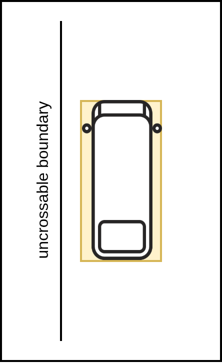</td>
      <td style="text-align: center;">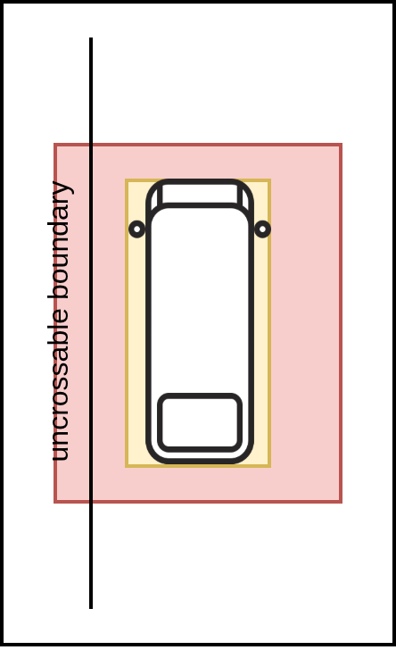</td>
    </tr>
  </table>

By expanding the footprint, the module introduces a safety margin that accounts for minor localization and mapping uncertainties, especially critical at higher speeds.he expanded footprint creates a small buffer or "safety margin," allowing the vehicle to operate safely despite minor abnormality.

### 3. Steering Abnormality

Unexpected steering behavior can cause the vehicle to deviate from its planned trajectory. Instead of using a simple margin, this module simulates a future trajectory based on a bicycle model with modified steering commands to predict potential deviations. This can occur due to:

- **Actuator faults**: such as delayed or stuck steering commands.
- **Software issues**: like frozen control outputs or bugs in the steering optimization logic.
- **Unexpected maneuvers**: for example, emergency avoidance or unintended sharp turns.

In such cases, the actual motion of the vehicle diverges from the MPC trajectory, increasing the risk of departure.

#### How steering simulation helps with steering abnormality

The module simulates a new vehicle trajectory using a bicycle model, where the steering commands are intentionally modified to represent a worst-case scenario. This simulation includes:

- **Actuator Delay**: A delay is introduced to the steering commands to simulate actuator latency.
- **Steering Magnification**: The original steering commands from the trajectory are multiplied by a factor to simulate over- or under-steering.
- **Steering Offset**: A constant offset is added to the steering commands to simulate a drift.
- **Rate Limiting**: The rate of change of the steering angle is limited based on the vehicle's velocity to ensure the simulation is physically realistic.
- **Physical Limits**: The final steering angle is clamped to the vehicle's maximum physical steering angle.

This simulated trajectory is then used to create a set of predicted footprints, which are checked for boundary departures. This allows the system to proactively detect and mitigate risks from steering abnormalities.

| Example steering abnormality trajectories                                                      |
| ---------------------------------------------------------------------------------------------- |
|  |

### 4. Longitudinal Tracking Abnormality

Sometimes, the actual motion of the vehicle along the longitudinal axis does not match the MPC-predicted trajectory. For instance:

The ego vehicle might be ahead or behind the predicted position due to mismatches in acceleration or braking behavior.

This discrepancy becomes more problematic when the vehicle is near an uncrossable boundary, as it reduces the reliability of future footprint predictions.

#### How Longitudinal Expansion Helps with Tracking Abnormality

- **Accounts for ego being ahead of the predicted pose**: During lane changes, avoidance maneuvers, or turns on curved roads, the ego vehicle may move faster than expected or take a slightly different path than predicted. By extending the footprint longitudinally (in the direction of motion), the module accounts for the ego vehicle possibly being ahead of the current MPC trajectory point.
- **Uses speed-scaled margins**: The longitudinal margin is scaled based on the current vehicle speed, with an added buffer. At higher speeds, a larger margin is used to reflect the increased risk and reduced reaction time.
- **Captures mismatches during dynamic maneuvers**: In situations where heading is changing quickly, like on curved roads or during lateral motion, the ego’s actual position may significantly deviate from the MPC path. The extended footprint covers this discrepancy and helps detect boundary risks even if the predicted path appears safe.

  <table style="table-layout: fixed; width: 600px;">
    <tr>
      <th style="text-align: center; width: 50%; word-wrap: break-word; white-space: normal;"> Without Abnormality Margins </th>
      <th style="text-align: center; width: 50%; word-wrap: break-word; white-space: normal;"> With Longitudinal Tracking Abnormality Margin </th>
    </tr>
    <tr>
      <td style="text-align: center;"></td>
      <td style="text-align: center;"></td>
    </tr>
  </table>

This approach helps bridge the gap between prediction and reality. By expanding the footprint in the heading direction, the module ensures safe operation even when there are longitudinal tracking mismatches due to control delay, road surface changes, or other dynamic factors.

## Types of Departure

The Boundary Departure Prevention Module classifies boundary risk into three types, each representing a different level of severity based on the proximity between the predicted footprint (including abnormality margins) and the road boundary.

  <table style="table-layout: fixed; width: 800px;">
    <tr>
      <th style="text-align: center; width: 50%; word-wrap: break-word; white-space: normal;">Near-Boundary</th>
      <th style="text-align: center; width: 50%; word-wrap: break-word; white-space: normal;">Approaching Departure and Critical Departure</th>
    </tr>
    <tr>
      <td style="text-align: center;"></td>
      <td style="text-align: center;"></td>
    </tr>
  </table>

### 1. Near-Boundary

The ego vehicle is approaching a road boundary but remains within a tolerable margin. This condition may arise:

- On narrow roads or lanes with minimal space.
- When expanded abnormality margins bring the footprint closer to the edge.
- During turns or lateral maneuvers near curbs.

### 2. Approaching Departure

The ego vehicle is still some distance away from the boundary, but its predicted path will eventually lead to a critical departure if no action is taken. This condition is triggered only when a critical departure is detected at a future point along the path.

### 3. Critical Departure

A portion of the **normal (non-expanded) ego footprint** crosses an uncrossable boundary. This condition is treated as a safety-critical violation.

Unlike **near-boundary** departure type, **abnormality margins** are not considered in this judgment. Including them would result in high number of false positives, especially on narrow or constrained roads. Instead, only the actual predicted footprint is used to determine a critical departure. Upon detecting a critical departure:

- The module does not insert a stop, but instead, it relies on previously triggered Approaching Departure to have already reduced the vehicle’s speed.
- The module can publish a diagnostic status, which can be configured to escalate to ERROR level.
- The ERROR level diagnostic can be connected to an external MRM (Minimum Risk Maneuver) system, which is responsible for issuing a full stop command.

## General process

The following diagram shows the high-level processing flow of the Boundary Departure Prevention Module. It outlines the steps from checking proximity to the goal, through trajectory and abnormality analysis, to the publication of debug and diagnostic data.

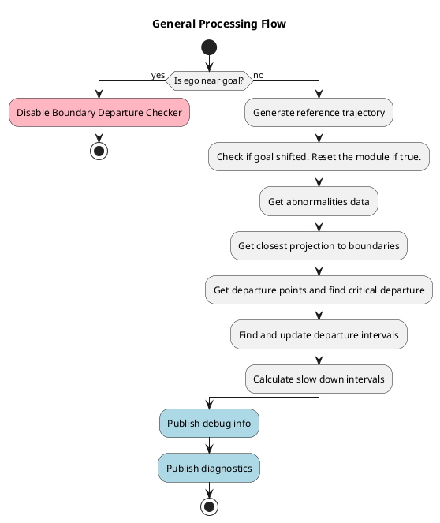

## Generating abnormalities data

The diagram below illustrates how the module processes predicted trajectory points to generate footprints with embedded abnormality margins and find their projections relative to nearby map boundaries.

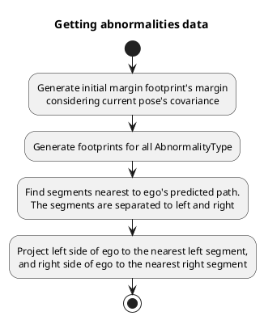

## Determining Closest Projection to Boundaries

To assess how close the ego vehicle is to nearby uncrossable boundaries, the `BoundaryDepartureChecker` class calculates the nearest lateral projection between each predicted footprint and the map boundary segments. This is done separately for the left and right sides of the vehicle.

Each footprint includes left and right edge segments. These segments are projected onto nearby map segments to compute the shortest lateral distance from the vehicle to the boundary.

For each pair of ego-side and boundary segments:

1. If the segments intersect, the intersection point is used as the projection result.
2. If not, the algorithm checks all endpoint-to-segment projections, from the ego footprint segment to the boundary segment, and vice versa.
3. Among all valid candidates, the one with the shortest lateral distance is selected.

The projection function returns the projected point on the boundary, the corresponding point on the ego segment, and the computed distance.

Example of the nearest projections are shown in the following images:

  <table style="table-layout: fixed; width: 800px;">
    <tr>
      <th style="text-align: center; width: 50%; word-wrap: break-word; white-space: normal;">Going near the boundary</th>
      <th style="text-align: center; width: 50%; word-wrap: break-word; white-space: normal;">Heading towards and departing from boundaries</th>
    </tr>
    <tr>
      <td style="text-align: center;"></td>
      <td style="text-align: center;"></td>
    </tr>
  </table>

- Each vehicle box represents a predicted footprint along the path.
- Red arrows show the closest projection to the left boundary.
- Purple arrows show the closest projection to the right boundary.

## Getting Departure Points and finding Critical Departure

Once the closest projections to boundaries are obtained, the module filters and classifies potential departure points to determine the appropriate response.

The classification of a potential departure point is determined by its lateral distance from the road boundary and the type of prediction that generated it. The module processes a series of predicted points along a trajectory, from the closest to the farthest.

- **Critical Departure**: This is the most severe type and has the highest work priority. A point is classified as a critical departure if it indicates the vehicle has already crossed the boundary, which is when the lateral distance is less than a minimum threshold, `th_dist_to_boundary_m.min`. Once a critical departure is found, all other departure points farther along the trajectory are ignored.
- **Near Boundary**: If a point is not a critical departure, it is then checked to see if it is a near boundary departure. This classification applies to any point where the lateral distance is less than or equal to a maximum threshold, `th_dist_to_boundary_m.max`. The module selects the point with the minimum lateral distance from among all prediction types.

The module calculates two key braking distances to inform the departure classification:

- **`minimum braking dist`**: The shortest distance required for the ego vehicle to stop safely without departing the lane. This is calculated using the maximum allowed acceleration and jerk (`th_acc_mps2.max` and `th_jerk_mps3.max`).
- **`maximum braking dist`**: The longest distance required for a comfortable deceleration before the vehicle gets too close to the boundary. This is calculated using the minimum allowed acceleration and jerk (`th_acc_mps2.min` and `th_jerk_mps3.min`).

Following equation is used

$$
d_{\text{total}} =
\begin{cases}
d_1 + d_2, & v_2 \le 0, \quad
t_2 = \dfrac{
-a_{\text{max}} - \sqrt{a_0^2 - 2 j v_0}
}{j} \\[12pt]
d_1 + d_2 + d_3, & v_2 > 0, \quad
t_2 = \dfrac{a_{\text{max}} - a_0}{j}
\end{cases}
$$

where

- $d_1 = v_0 \cdot t_1$: distance during delay
- $d_2 = v_0 t_2 + \dfrac{1}{2} a_0 t_2^2 + \dfrac{1}{6} j t_2^3$: distance during jerk-limited deceleration
- $d_3 = -\dfrac{v_2^2}{2 a_{\text{max}}}$: distance under constant deceleration (if needed)
- $v_2 = v_0 + \dfrac{a_{\text{max}}^2 - a_0^2}{2j}$: velocity after jerk ramp

These distances are used to determine if a predicted departure is within a reachable range. Specifically, the module uses these distances to make two key decisions:

1. A `Near Boundary` point is only considered for a slowdown if it is within `max_braking_dist`.
2. A `Critical Departure` point is only considered for an emergency stop if it is within `min_braking_dist`.
3. A `Critical Departure` point is reclassified as an `Approaching Departure` if it is found beyond `min_braking_dist`, as it is too far for an immediate emergency response.
   - Any preceding points are also reclassified to `Approaching Departure` if they are within `max_braking_dist` of the critical point.

The module also filters closely spaced departure points. This process ensures that multiple, minor issues are treated as a single event, simplifying the module's response.

  <table style="table-layout: fixed; width: 800px;">
    <tr>
      <th style="text-align: center; width: 25%; word-wrap: break-word; white-space: normal;">Closest points to boundaries</th>
      <th style="text-align: center; width: 25%; word-wrap: break-word; white-space: normal;">Departure points</th>
      <th style="text-align: center; width: 25%; word-wrap: break-word; white-space: normal;">Grouping nearby points</th>
      <th style="text-align: center; width: 25%; word-wrap: break-word; white-space: normal;">Remaining points after merging</th>
    </tr>
    <tr>
      <td style="text-align: center;"></td>
      <td style="text-align: center;">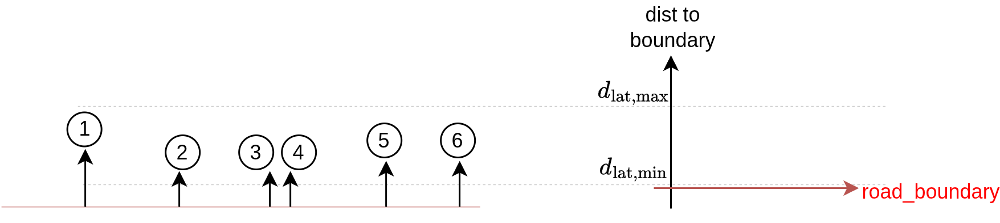</td>
      <td style="text-align: center;"></td>
      <td style="text-align: center;">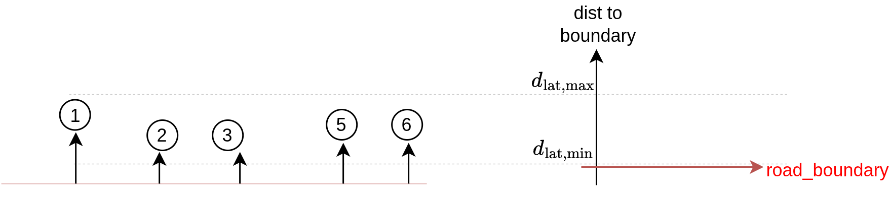</td>
    </tr>
  </table>

## Get and updating departure intervals

Path chattering is a problem that occurs when a slowdown command shortens the vehicle's predicted trajectory. This shortened path might temporarily eliminate the very departure point that caused the slowdown, leading the module to believe the risk is gone and to cancel the command. The path then lengthens again, the departure is re-detected, and the cycle repeats.

The module uses departure intervals to maintain stable slowdown commands and prevent path chattering. Instead of simply reacting to a single departure point, which could change rapidly from one moment to the next, the module defines a continuous segment of the trajectory where a slowdown is active. This approach avoids a "fluttering" effect where the vehicle repeatedly slows down, then accelerates, then slows down again.

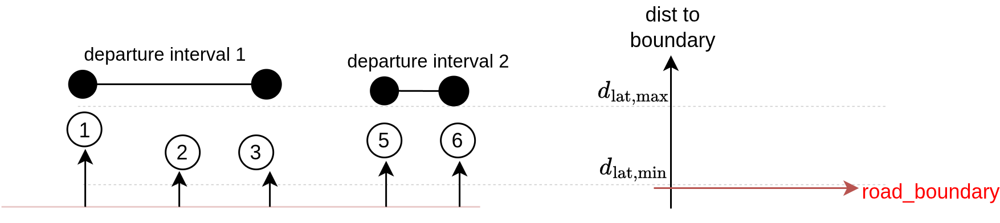

The module merges any new departure points or existing intervals that overlap with each other. For instance, if a new point is detected that is close to an existing slowdown interval, that interval will be extended to include the new point. This ensures the module issues one cohesive command rather than multiple, conflicting ones. This merging process prevents the vehicle from starting and stopping a slowdown for every minor deviation, promoting a smoother and safer ride.

  <table style="table-layout: fixed; width: 800px;">
    <tr>
      <th style="text-align: center; width: 50%; word-wrap: break-word; white-space: normal;">Before merge</th>
      <th style="text-align: center; width: 50%; word-wrap: break-word; white-space: normal;">After merge</th>
    </tr>
    <tr>
      <td style="text-align: center;">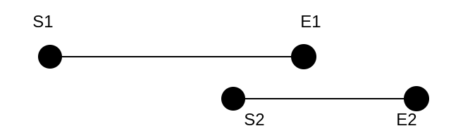</td>
      <td style="text-align: center;">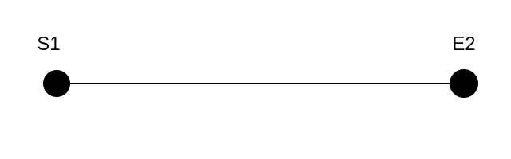</td>
    </tr>
    <tr>
      <td style="text-align: center;"></td>
      <td style="text-align: center;"></td>
    </tr>
    <tr>
      <td style="text-align: center;">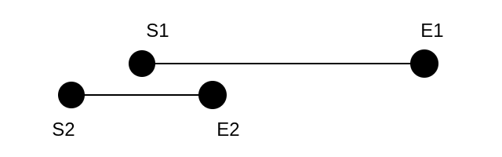</td>
      <td style="text-align: center;">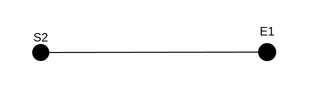</td>
    </tr>
  </table>

## Handling Unstable Predictions with Time Buffers

The module employs a continuous detection mechanism to stabilize its response to boundary predictions, preventing two types of errors: unnecessary deceleration (**false positives**) and sudden, late deceleration (**false negatives**).

### 1. Preventing Unnecessary Actions

The **`on_time_buffer_s`** is a filter that prevents the module from overreacting to fleeting or unstable predictions. The module will only insert a departure into a list if a potential boundary departure is detected continuously for a specific duration.

- **Near Boundary**: A slowdown is initiated only after a potential departure is detected for a duration greater than or equal to `on_time_buffer_s.near_boundary`. This handles general cases of the vehicle getting close to a boundary, acting as a safeguard against **false positives**.
- **Critical Departure**: For more severe, high-risk situations, a separate check uses **`on_time_buffer_s.critical_departure`**. A critical departure is added to a **critical departure points list** only if a critical departure is consistently detected over this dedicated time period. For further usage of this list, refer to the Diagnostic Section.

### 2. Preventing Prematurely Ending Actions

The **`off_time_buffer_s`** is a filter that prevents the module from prematurely ending a response. Once an action is active, it won't be cleared until the module is confident the risk has passed.

- **Near Boundary**: A slowdown is only cleared when no departure points are detected for a continuous duration greater than or equal to `off_time_buffer_s.near_boundary`. This prevents a **false negative**, where a brief absence of a prediction causes the vehicle to accelerate again, even if it's still in a dangerous state.
- **Critical Departure**: The module uses `off_time_buffer_s.critical_departure` to manage a critical departure list. This list is cleared only after a critical departure has not been detected for a continuous period.

## Calculate slow down

### 1. Target Velocity from Lateral Clearance

The target velocity, $v_{\text{target}}$, is determined based on the vehicle's lateral distance from the boundary. This process ensures the vehicle's speed is reduced as it gets closer to the specified boundary (e.g. `road_border`).

- **Concept**: The module defines a **minimum velocity** ($v_{\min}$) and a **maximum velocity** ($v_{\max}$). It also sets a **safe lateral zone** between a minimum distance ($d_{\text{lat,min}}$) and a maximum distance ($d_{\text{lat,max}}$).
- **How it Works**:
  - If the vehicle is too close to the boundary (at or within $d_{\text{lat,min}}$), the module commands the minimum velocity, $v_{\min}$.
  - If the vehicle is well within its lane (at or beyond $d_{\text{lat,max}}$), it is permitted to drive at the maximum velocity, $v_{\max}$.
  - If the vehicle is between these two distances, its target velocity is scaled between $v_{\min}$ and $v_{\max}$. This is achieved by a linear interpolation.

The target velocity, $v_{\text{target}}$, is calculated using the following formula:

$$
v_{\text{target}}(d_{\text{lat}})=
\begin{cases}
v_{\min}, &
d_{\text{lat}} \le d_{\text{lat,min}},\\[8pt]
v_{\min}
+\displaystyle \frac{d_{\text{lat}}-d_{\text{lat,min}}}{\,d_{\text{lat,max}}-d_{\text{lat,min}}\,}
\,(v_{\max}-v_{\min}), &
d_{\text{lat,min}}< d_{\text{lat}} < d_{\text{lat,max}},\\[12pt]
v_{\max}, &
d_{\text{lat}} \ge d_{\text{lat,max}}.
\end{cases}
$$

### 2. Longitudinal feasibility and deceleration tiers

Once the $v_{\text{target}}$ is determined, the distance to the start of target interval (i.e.: **longitudinal gap**, ), is used to decide on the appropriate deceleration profile. The module prioritizes comfort and only uses more aggressive braking when necessary.

The module chooses one of three deceleration tiers:

- **Comfort**: The module first checks if it can slow down to the target velocity using a comfortable deceleration profile. This profile is defined by gentle limits on jerk and acceleration ($(j_{\text{comfort}}\le0,\ a_{\text{comfort}}\le0)$). If the distance to the start of target interval is sufficient for this gentle braking, the comfort profile is selected.
- **Feasible**: If the comfort profile is not sufficient to stop in time, the module finds the **least-negative** (or most gentle) acceleration that will still allow the vehicle to reach the target velocity within the available gap. This is like pressing the brake pedal a bit harder, but only as much as needed. The jerk remains at the comfortable limit ($j_{\text{brake}} = j_{\text{comfort}}$) to avoid abrupt changes.
- **Hard**: If neither of the above profiles is sufficient, the module applies the **maximum possible braking** (the "hard" limits on jerk and acceleration, $(j_{\max}\le0,\ a_{\max}\le0)$). This is used in situations where a quick, forceful stop is required to avoid prevent ego from driving onto the road boundary.

### 3) Commanded speed via an analytic S-curve (with equations)

This section details how the module calculates the final slow down velocity based on the deceleration profile selected in Section 2. It uses an analytic S-curve to ensure a smooth, comfortable deceleration to the target velocity at the specified distance. An S-curve motion profile provides a smooth transition by controlling the rate of change of acceleration, or jerk.

The values for **jerk** ($j_{\text{brake}}$) and **braking acceleration** ($a_{\text{brake}}$) used in the following steps are determined by the **longitudinal feasibility tier** selected earlier (Comfort, Feasible, or Hard).

!!! Note

    To prevent sudden, unintended deceleration, the module returns the largest safe velocity if the longitudinal gap is very small. This ensures that the vehicle does not brake abruptly when approaching the target point.

#### 1. Deceleration Selection\*\*

The module begins by selecting the initial active acceleration, $a_{\text{act}}$, which is the lesser (more negative) of the current acceleration and the braking acceleration value from the selected tier. The jerk, $j$, is also set to the value from the selected tier.

$$
a_{\text{act}}=\min(a_{\text{curr}},\ a_{\text{brake}})\le 0,\qquad j=j_{\text{brake}}\le 0.
$$

#### 2. **Jerk Ramp**

The vehicle enters a jerk phase where its acceleration changes smoothly over time. The equations below describe the vehicle's acceleration, velocity, and distance during this phase.

$$
\begin{aligned}
a(t)&=a_{\text{act}}+j\,t,\\
v(t)&=v_0+a_{\text{act}}\,t+\tfrac12 j t^2,\\
s(t)&=v_0\,t+\tfrac12 a_{\text{act}}\,t^2+\tfrac16 j t^3,\\[4pt]
t_j&=\frac{a_{\text{brake}}-a_{\text{act}}}{j}\ (\ge 0),\\
v_1&=v(t_j)=v_0+\tfrac12\frac{a_{\text{brake}}^{2}-a_{\text{act}}^{2}}{j},\\
s_j&=s(t_j).
\end{aligned}
$$

#### 3. **Waypoint Inside the Jerk Ramp**

If the longitudinal distance to the start of the target interval, $s_\star$, falls within the distance covered during the initial jerk phase ($s_\star \in [0, s_j]$), the module finds the required time and corresponding velocity to reach that point. The slow down velocity, $v_{\text{cmd}}$, is then set to the greater of the target velocity and the velocity calculated for that point, ensuring a safe and controlled deceleration.

$$v_{\text{cmd}} = \max\left(v_{\text{target}},\, v(t^\star)\right)$$

#### 4. **Waypoint After the Jerk Ramp**

If the target point is farther away ($s_\star > s_j$), the vehicle will have completed its initial jerk phase. The remaining distance, $s_{\text{rem}}$, is used to calculate the final velocity. The slow down velocity is determined based on the constant deceleration phase that follows the initial jerk.

$$
\begin{aligned}
\Delta &= v_1^2 - v_{\text{target}}^2 + 2\,a_{\text{brake}}\,s_{\text{rem}}, \\
\text{if } \Delta < 0 &: \quad v_{\text{cmd}} = v_{\text{target}}, \\
\text{else } \quad t_a &= \frac{-v_1 + \sqrt{\Delta}}{a_{\text{brake}}}, \qquad
v_{\text{cmd}} = \max\left(v_{\text{target}},\, v_1 + a_{\text{brake}}\,t_a\right)
\end{aligned}
$$

## Parameters

{{ json_to_markdown("planning/motion_velocity_planner/autoware_motion_velocity_boundary_departure_prevention_module/schema/boundary_departure_prevention.schema.json") }}
