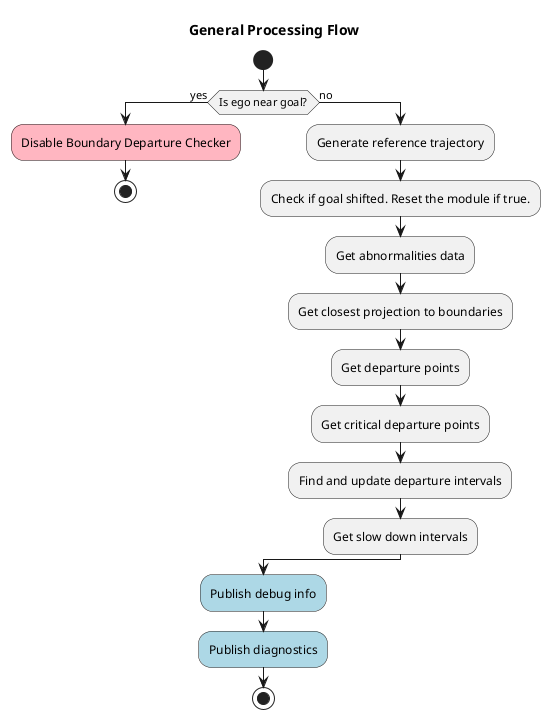

# Boundary Departure Prevention Module

!!! Warning

    The Boundary Departure Prevention Module is experimental. It subscribes to the control module’s predicted path and steering report, creating a circular dependency. This violates Autoware’s design principle of forward-only data flow, where control depends on planning, not the other way round. As a result, this module is not officially supported and will remain unofficial for the foreseeable future.

## Role

This module inserts slow down points and publishes error diagnostics when the ego vehicle is near or about to cross an uncrossable boundary, such as a road border.

It also accounts for several types of erroneous behavior that could cause the vehicle to unintentionally cross these boundaries. These behaviors are classified as abnormalities.

## Abnormalities

Abnormalities refer to erroneous behaviors at the component level, often caused by noisy or unreliable outputs. In this module, these abnormalities are embedded into the predicted footprints derived from the control module's predicted path, specifically, the MPC (Model Predictive Control) trajectory. Each point along the MPC path is converted into a footprint, and potential deviations due to abnormal conditions are evaluated.

The module addresses the following types of abnormalities:

### 1. Normal (No Abnormality)

In typical operation, the MPC trajectory may contain small deviations or noise, especially when the vehicle cannot track the planned path perfectly. These deviations are minor and not necessarily the result of a malfunction, but they are still accounted for to ensure safe boundary handling.

### Localization Abnormality

Localization errors can cause the ego vehicle to misjudge its position relative to road boundaries such as curbs or road edges. This can happen due to:

- **Sensor noise or drift**, leading to inaccurate pose estimation.
- **Map inaccuracies**, where the HD map’s geometry does not precisely align with the real-world boundary.
- **Dynamic uncertainty** at higher speeds, where even small errors are magnified due to the vehicle covering more distance in less time, reducing the margin for correction.

These factors can result in the vehicle unintentionally approaching or crossing an uncrossable boundary, even when the planned path appears valid.

#### How Footprint Expansion Helps with Localization and Map Errors

- **Provides a conservative buffer for localization errors**: If the ego vehicle’s estimated position is off due to GPS drift or sensor noise, the expanded footprint increases the likelihood of detecting potential boundary conflicts. While this may lead to conservative (and possibly false) detections, it helps ensure safety by accounting for uncertainty in the vehicle’s true position.
- **Compensates for map inaccuracies**: Slight misalignments in Lanelet2 map geometries, such as curb or road edge misplacement, can make it difficult to rely on raw map boundaries. Expanding the footprint ensures that even with these inaccuracies, the system remains cautious and avoids unintentional boundary violations.

  <table style="table-layout: fixed; width: 600px;">
    <tr>
      <th style="text-align: center; width: 50%; word-wrap: break-word; white-space: normal;">Without Abnormality Margins</th>
      <th style="text-align: center; width: 50%; word-wrap: break-word; white-space: normal;">With Localization Abnormality Margin</th>
    </tr>
    <tr>
      <td style="text-align: center;"></td>
      <td style="text-align: center;"></td>
    </tr>
  </table>

By expanding the footprint, the system introduces a safety margin that accounts for minor localization and mapping uncertainties, especially critical at higher speeds.he expanded footprint creates a small buffer or "safety margin," allowing the vehicle to operate safely despite minor abnormality.

### Steering Abnormality

Unexpected steering behavior can cause the vehicle to deviate from its planned trajectory, leading to boundary departure even when planning and localization are functioning correctly. This can occur due to:

- **Actuator faults**: such as delayed or stuck steering commands.
- **Software issues**: like frozen control outputs or bugs in the steering optimization logic.
- **Unexpected maneuvers**: for example, emergency avoidance or unintended sharp turns.

In such cases, the actual motion of the vehicle diverges from the MPC trajectory, increasing the risk of departure.

#### How steering margin helps with steering abnormality

- **Catches lateral deviations early**: If the vehicle drifts due to steering faults, like stuck actuators or sudden command spikes, the expanded margin ahead of the vehicle can detect the deviation before the ego crosses into an unsafe region.
- **Predicts future risk along the path**: The margin extends along the forward direction of the predicted path, enabling the system to foresee potential boundary violations caused by small steering errors that compound over time.

  <table style="table-layout: fixed; width: 600px;">
    <tr>
      <th style="text-align: center; width: 50%; word-wrap: break-word; white-space: normal;">Without Abnormality Margins</th>
      <th style="text-align: center; width: 50%; word-wrap: break-word; white-space: normal;">With Steering Abnormality Margin</th>
    </tr>
    <tr>
      <td style="text-align: center;"></td>
      <td style="text-align: center;"></td>
    </tr>
  </table>

This method works even when control outputs are inaccurate. Because the margin is computed using the predicted path, not just the current pose, it accounts for latency, actuator delays, and other uncertainties in vehicle response. This allows the system to trigger early mitigation actions, such as slowing down or stopping, before the situation becomes critical.

### Longitudinal Tracking Abnormality

Sometimes, the actual motion of the vehicle along the longitudinal axis does not match the MPC-predicted trajectory. For instance:

The ego vehicle might be ahead or behind the predicted position due to mismatches in acceleration or braking behavior.

This discrepancy becomes more problematic when the vehicle is near an uncrossable boundary, as it reduces the reliability of future footprint predictions.

#### How Longitudinal Expansion Helps with Tracking Abnormality

- **Accounts for ego being ahead of the predicted pose**: During lane changes, avoidance maneuvers, or turns on curved roads, the ego vehicle may move faster than expected or take a slightly different path than predicted. By extending the footprint longitudinally (in the direction of motion), the system accounts for the ego vehicle possibly being ahead of the current MPC trajectory point.
- **Uses speed-scaled margins**: The longitudinal margin is scaled based on the current vehicle speed, with an added buffer. At higher speeds, a larger margin is used to reflect the increased risk and reduced reaction time.
- **Captures mismatches during dynamic maneuvers**: In situations where heading is changing quickly, like on curved roads or during lateral motion, the ego’s actual position may significantly deviate from the MPC path. The extended footprint covers this discrepancy and helps detect boundary risks even if the predicted path appears safe.

  <table style="table-layout: fixed; width: 600px;">
    <tr>
      <th style="text-align: center; width: 50%; word-wrap: break-word; white-space: normal;"> Without Abnormality Margins </th>
      <th style="text-align: center; width: 50%; word-wrap: break-word; white-space: normal;"> With Longitudinal Tracking Abnormality Margin </th>
    </tr>
    <tr>
      <td style="text-align: center;"></td>
      <td style="text-align: center;"></td>
    </tr>
  </table>

This approach helps bridge the gap between prediction and reality. By expanding the footprint in the heading direction, the system ensures safe operation even when there are longitudinal tracking mismatches due to control delay, road surface changes, or other dynamic factors.

## Types of Departure

The Boundary Departure Prevention Module classifies boundary risk into three types, each representing a different level of severity based on the proximity between the predicted footprint (including abnormality margins) and the road boundary.

  <table style="table-layout: fixed; width: 800px;">
    <tr>
      <th style="text-align: center; width: 50%; word-wrap: break-word; white-space: normal;">Near-Boundary</th>
      <th style="text-align: center; width: 50%; word-wrap: break-word; white-space: normal;">Approaching Departure and Critical Departure</th>
    </tr>
    <tr>
      <td style="text-align: center;"></td>
      <td style="text-align: center;"></td>
    </tr>
  </table>

### 1. Near-Boundary

The ego vehicle is approaching a road boundary but remains within a tolerable margin. This condition may arise:

- On narrow roads or lanes with minimal space.
- When expanded abnormality margins bring the footprint closer to the edge.
- During turns or lateral maneuvers near curbs.

### 2. Approaching Departure

The ego vehicle is still some distance away from the boundary, but its predicted path will eventually lead to a critical departure if no action is taken. This condition is triggered only when a critical departure is detected at a future point along the path.

### 3. Critical Departure

A portion of the normal (non-expanded) ego footprint crosses an uncrossable boundary. This condition is treated as a safety-critical violation.

Unlike other departure types, abnormality margins are not considered in this judgment. Including them would increase the risk of false positives, especially on narrow or constrained roads. Instead, only the actual predicted footprint is used to determine a critical departure. Upon detecting a critical departure:

- The module does not insert a stop, but instead, it relies on previously triggered Approaching Departure to have already reduced the vehicle’s speed.
- The module can publish a diagnostic status, which can be configured to escalate to ERROR level.
- The ERROR level diagnostic can be connected to an external MRM (Minimum Risk Maneuver) system, which is responsible for issuing a full stop command.

## Processing Flow

The following diagram shows the high-level processing flow of the Boundary Departure Prevention Module. It outlines the steps from checking proximity to the goal, through trajectory and abnormality analysis, to the publication of debug and diagnostic data.

### Generating abnormalities data

The diagram below illustrates how the module processes predicted trajectory points to generate footprints with embedded abnormality margins and find their projections relative to nearby map boundaries.

#### Determining Closest Projection to Boundaries

To assess how close the ego vehicle is to nearby uncrossable boundaries, the `BoundaryDepartureChecker` class calculates the nearest lateral projection between each predicted footprint and the map boundary segments. This is done separately for the left and right sides of the vehicle.

Each footprint includes left and right edge segments. These segments are projected onto nearby map segments to compute the shortest lateral distance from the vehicle to the boundary.

For each pair of ego-side and boundary segments:

1. If the segments intersect, the intersection point is used as the projection result.
2. If not, the algorithm checks all endpoint-to-segment projections, from the ego footprint segment to the boundary segment, and vice versa.
3. Among all valid candidates, the one with the shortest lateral distance is selected.

The projection function returns the projected point on the boundary, the corresponding point on the ego segment, and the computed distance.

Example of the nearest projections are shown in the following images:

  <table style="table-layout: fixed; width: 800px;">
    <tr>
      <th style="text-align: center; width: 50%; word-wrap: break-word; white-space: normal;">Going near the boundary</th>
      <th style="text-align: center; width: 50%; word-wrap: break-word; white-space: normal;">Heading towards and departing from boundaries</th>
    </tr>
    <tr>
      <td style="text-align: center;"></td>
      <td style="text-align: center;"></td>
    </tr>
  </table>

- Each vehicle box represents a predicted footprint along the path.
- Red arrows show the closest projection to the left boundary.
- Purple arrows show the closest projection to the right boundary.

### Find and update departure intervals

!!! Warning

    TBA

### Get slow down intervals

!!! Warning

    TBA

## Parameters

{{ json_to_markdown("planning/motion_velocity_planner/autoware_motion_velocity_boundary_departure_prevention_module/schema/boundary_departure_prevention.schema.json") }}
