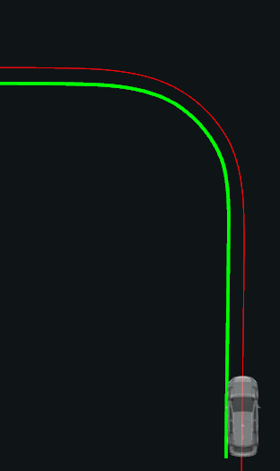
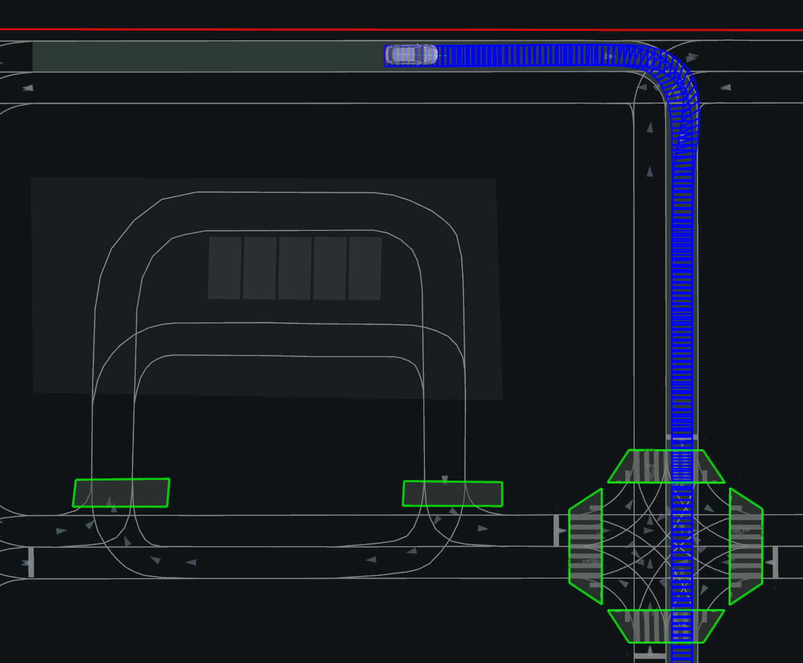
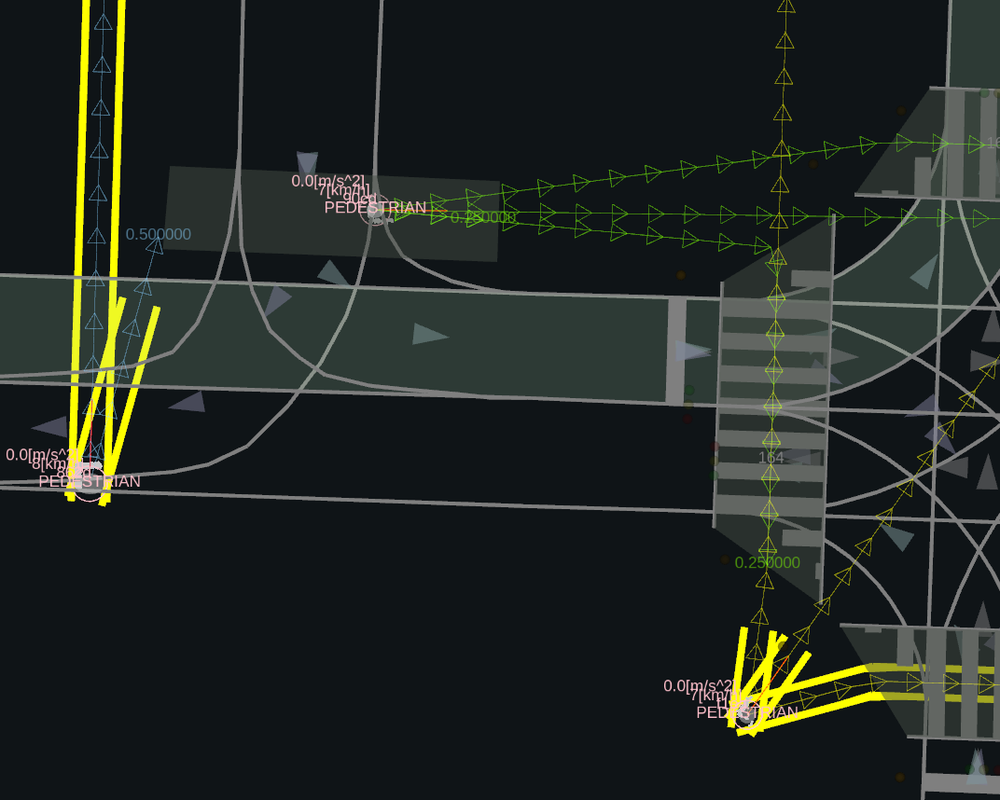

# Run Out

## Role

The `run_out` module adds deceleration and stop points to the ego trajectory in order to prevent collisions with objects that are moving towards the ego vehicle path.

## Activation

This module is activated if the launch parameter `launch_mvp_run_out_module` is set to true.

## Inner-workings / Algorithms

This module calculates the times when the ego vehicle and the objects are predicted to overlap each other's trajectories.
These times are then used to decide whether to stop before the overlap or not.

Next we explain the inner-workings of the module in more details.

### 1. Ego trajectory footprint

In this first step, the trajectory footprint is constructed from the corner points of the vehicle.
4 linestrings are constructed from the 4 corners (front left, front right, rear left, rear right) projected at each trajectory point.

At this step, the footprint size can be adjusted using the `ego.lateral_margin` and `ego.longitudinal_margin` parameters.

The following figures show the 4 corner linestrings calculated for the red trajectory.

| front left                                                | front right                                                 | rear left                                               | rear right                                                |
| --------------------------------------------------------- | ----------------------------------------------------------- | ------------------------------------------------------- | --------------------------------------------------------- |
|  |  |  |  |

These can be visualized on the debug markers with the `ego_footprint_(front|rear)_(left|right)` namespaces.

### 2. Extracting map filtering data

In the second step, we extract geometric information from the vector map that will be used to filter dynamic objects.
For each object classification label,
we prepare the following sets of geometries based on the parameters defined for that label (`objects.{CLASSIFICATION_LABEL}`):

- polygons to ignore objects (`ignore.polygon_types` and `ignore.lanelet_subtypes`);
  - polygons for the ego trajectory footprint are also added if `ignore.if_on_ego_trajectory` is set to `true`.
- polygons to ignore collisions (`ignore_collisions.polygon_types` and `ignore_collisions.lanelet_subtypes`);
- segments to cut predicted paths (`cut_predicted_paths.polygon_types`, `cut_predicted_paths.linestring_types`, and `cut_predicted_paths.lanelet_subtypes`).
  - the rear segment of the current ego footprint is also added if `cut_predicted_paths.if_crossing_ego_from_behind` is set to `true`.

The following figure shows an example where the polygons to ignore objects are shown in blue, to ignore collisions in green, and to cut predicted paths in red.

These geometries can be visualized on the debug markers with the `filtering_data_(ignore_objects|ignore_collisions|cut_predicted_paths)` namespaces.
The classification label corresponding to the published debug markers can be selected with parameter `debug.object_label`.

### 3. Dynamic objects filtering

In this step, objects and their predicted paths are filtered based on its classification label and the corresponding parameters `objects.{CLASSIFICATION_LABEL}`.

An object is ignored if one of the following condition is true:

- its classification label is not in the list defined by the `objects.target_labels` parameter;
- its velocity is bellow the `ignore.stopped_velocity_threshold` and `ignore.if_stopped` is set to `true`;
- its current footprint is inside one of the polygons prepared in the previous step.

However, if it was decided to stop for the object in the previous iteration,
or if a collision was detected with the object, then it cannot be ignored.

If an object is not ignored, its predicted path footprints are generated similarly to the ego footprint
First, we only keep predicted paths that have a confidence value above the `confidence_filtering.threshold` parameter.
If, `confidence_filtering.only_use_highest` is set to `true` then for each object only the predicted paths that have the higher confidence value are kept.
Next, the remaining predicted paths are cut according to the segments prepared in the previous step.

The following figures shows an example where crosswalks are used to ignore pedestrians and to cut their predicted paths.

| debug markers (`objects_footprints`)                        | objects of interest                                     |
| ----------------------------------------------------------- | ------------------------------------------------------- |
|  |  |

The result of the filtering can be visualized on the debug markers with the `objects_footprints` namespace which shows in yellow which predicted path will be used for collision checking in the next step.

In addition, the objects of interests markers shows which objects are not ignored and the color will correspond to the decision made towards that object (green for nothing, yellow for slowdown, and red for stop).

### 4. Collision detection

Now that we prepared the ego trajectory footprint, the dynamic objects, and their predicted paths,
we will calculate the times when they are predicted to collide.

The following operations are performed for each object that was not ignored in the previous iteration.

First, we calculate the intersections between each pair of linestrings between the ego and object footprints.
For each intersection, we calculate the corresponding point,
the time when ego and the object are predicted to reach that point,
and the location of that point on the ego footprint (e.g., on the rear left linestring).

All these intersections are then combined into intervals representing when the overlap between the ego trajectory and object predicted paths starts and ends.
An overlap is represented by the entering and exiting intersections for both ego and the object.

These overlaps calculated for all the object's predicted paths are then combined if overlapping in time (including the `collision.time_overlap_tolerance` parameter).
and classified into the following collision types:

- `ignored_collision` if one of the following condition is true:
  - parameter `collision.ignore_conditions.if_ego_arrives_first.enable` is set to `true` and:
    - ego enters the overlap at least `time_margin` seconds before the object.
      - `time_margin` is calculated based on the time when ego enters the overlap, which is used to interpolate the margin using the mapping between `margin.ego_enter_times` and `margin.time_margins`.
    - ego does not overlap the object's path by more than `max_overlap_duration` seconds.
  - parameter `collision.ignore_conditions.if_ego_arrives_first.enable` is set to `true` and:
    - ego cannot stop before entering the interval by using the deceleration limit set with `deceleration_limit`.
- `collision` if ego and the object are predicted to be in the overlap at the same time.
  - the time distance between the time intervals of ego and the objects must be smaller than the `time_margin` parameter (a distance of 0 means that the intervals overlap).
- `pass_first_no_collision` if ego is predicted to exit the overlap before the object enters it.
- `no_collision` in all other cases.

In the case where a collision is detected, the corresponding collision time is calculated
based on the yaw difference between the object and the ego vehicle at the first intersection point.

- default: collision time is set to the time when ego enters the overlap.
- object yaw is within `collision.same_direction_angle_threshold` of the ego yaw:
  - if the object is faster than ego, no collision will happen and the type is changed to `no_collision`.
  - the collision time is increased based on the velocity difference.
- object yaw is within `collision.opposite_direction_angle_threshold` of the opposite of the ego yaw:
  - the collision time is increased based on the estimated time when ego will collide will the object after entering the overlap.

The following figure shows the collision points in red and a table showing each overlap found and the corresponding collision type, ego and object time intervals, and predicted ego collision time.

The collisions points and the table can be visualized on the debug markers with the `collisions_points` and `collisions_table` namespaces.

### 5. Decisions

We will now make the decision towards each object on whether to stop, slowdown, or do nothing.
For each object, we consider what decision each collision require, and keep the one with highest priority as follows:

- `stop` types have higher priority than `slowdown` types.
- for two decisions of the same type, the one whose predicted collision time is earlier has higher priority.

Once a decision is made, the history of the object is updated and will allow to know,
for each previous time step, what was the decision made and the type of collision identified.

To decide the type of a collision, we use the decision history of the object
and first check if it satisfies the following conditions to stop:

- if the current collision type is `collision` and collisions with the object have been identified for a consecutive duration of at least `stop.on_time_buffer` seconds.
- if the previous decision was `stop` and the time since the last identified collision with the object was less than `stop.off_time_buffer` seconds ago.

If the condition to stop is not met, we check the following conditions to slowdown as follows:

- if the current collision type is `collision` and collisions with the object have been identified for a consecutive duration of at least `slowdown.on_time_buffer` seconds.
- if the previous decision was `slowdown` and the time since the last identified collision with the object was less than `slowdown.off_time_buffer` seconds ago.

The decision table can be visualized on the debug markers with the `decisions` namespace.

### 6. Calculate the stop or slowdowns

Finally, for each object, we calculate how the velocity profile will be modified based on the decision made:

- `stop`: insert a `0` velocity ahead of the predicted collision point by the distance set in the `stop.distance_buffer` parameter.
- `slowdown`: insert a $V_{slow}$ velocity between the collision point and the point ahead of collision point by the distance set in the `slowdown.distance_buffer` parameter.
  - $V_{slow}$ is calculated as the maximum between the safe velocity and the comfortable velocity.
    - safe velocity: velocity required to be able to stop over the `distance_buffer` assuming a deceleration as set by the
      `stop.deceleration_limit` parameter.
    - comfortable velocity: velocity ego would reach assuming it constantly decelerates at the
      `slowdown.deceleration_limit` parameter until the slowdown point.

The slowdowns and stops inserted in the trajectory are visualized with the virtual walls.

If an inserted `stop` point requires a stronger deceleration than set by the `stop.deceleration_limit` parameter, then an ERROR diagnostic is published to indicate that the stop in unfeasible.

### Use of Rtree for fast spatial queries

In step 1, each segment of the 4 linestrings of the ego trajectory footprint are stored in a Rtree
along with the corresponding trajectory point index.
This allows to efficiently find intersections with an object's predicted path along with the corresponding ego trajectory segment
from which the interpolated `time_from_start` can be calculated.

In step 2, the polygons and linestrings used for filtering the objects are stored in Rtree objects to efficiently find whether
an object is inside a polygon or if its predicted path intersects a linestring.

For more information about Rtree, see <https://beta.boost.org/doc/libs/1_82_0/libs/geometry/doc/html/geometry/spatial_indexes/introduction.html>

### Accounting for prediction inaccuracies

When calculating predicted collisions between ego and the objects,
we assume that the input ego trajectory contains accurate `time_from_start` values.
Similarly, accurate predicted paths are expected to be provided for the objects.

To allow for errors in these predictions, margins around the time intervals can be added using the parameters
`collision.time_margin`.
Higher values of this parameter will make it more likely to detect a collision and generate a stop.

The time buffers `on_time_buffer` and `off_time_buffer` allow to delay the addition or removal of the decisions to stop/slowdown.
Higher values prevent incorrect decisions in case of noisy object predictions, but also increase the reaction time, possibly causing stronger decelerations once a decision is made.

## Module Parameters

{{ json_to_markdown("planning/motion_velocity_planner/autoware_motion_velocity_run_out_module/schema/run_out.schema.json") }}

## Flow Diagram

## Debugging and Tuning Guide

### Ego does not stop for the incoming object

Possible reasons to investigate:

- the object classification label is not in the `objects.target_labels`;
- the object is inside an ignore polygon (`objects.LABEL.ignore.polygon_types` or `lanelet_subtypes`);
- the object is on the ego trajectory (`objects.LABEL.ignore.if_on_ego_trajectory`) or behind ego (`if_behind_ego`);
- the predicted path of the object is cut (`objects.LABEL.cut_predicted_paths.polygon_types`, `lanelet_subtypes`, or `linestring_types`);
- the collision is ignored;
  - ego does not have time to stop (`ignore_conditions.if_ego_arrives_first_and_cannot_stop`);
    - `deceleration_limit` can be increased.
  - ego is predicted to pass before the object (`ignore_conditions.if_ego_arrives_first`), including the time margin (calculated from `margin.ego_enter_times` and `margin.time_margins`);
    - `time_margins` can be increased.
- the collision is not detected;
  - `collision.time_margin` can be increased.
  - the ego footprint can be made larger (`ego.lateral_margin` and `ego.longitudinal.margin`).
