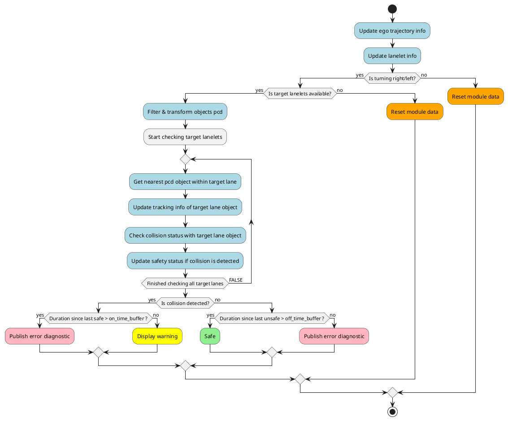
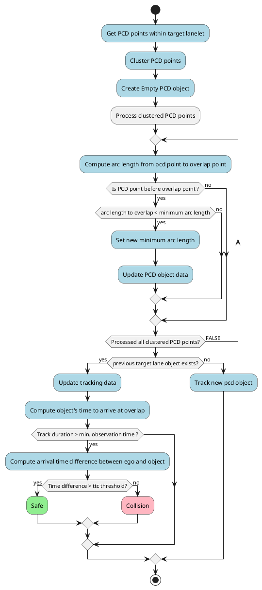

# Intersection Collision Checker

The `intersection_collision_checker` is a plugin module of `autoware_planning_validator` node. It is responsible for validating the planning trajectory at intersections by verifying that it does NOT lead to a collision with other road vehicles.

The check is executed only when:

- Ego is approaching a `turn_direction` lane
- Ego trajectory intersects with lanes other than `route_lanelets`

## Inner Workings

The intersection_collision_checker checks for collisions using pointcloud data and route information. It identifies target lanes at intersections and extracts pcd objects withing target lanes, and performs simplistic tracking and velocity estimation of pcd objects for each target lane. Times to arrival are computed for Ego and pcd objects, and the difference in the arrival time is used to judge if a collision is imminent.

### Flowchart

The following diagram illustrates the overall flow of module implementation:

### Ego Trajectory

The intersection_collision_checker module utilizes the ego trajectory subscribed to by planning_validator node, it uses the resampled trajectory to avoid clustered trajectory points in low velocity areas.
The for each trajectory point the time_from_start is computed with respect to the ego's front pose and the ego's back pose. This information is later used to estimate the ego's entry and exit times for each target lanelet.

### Target Lanelets

The module applies slightly different logic for acquiring target lanes for right and left turn intersections. In case of right turn intersection, the aim is to check all lanes crossing/overlapping with the egos intended trajectory. In case of left turn, the aim is check no vehicles are coming along the destination lane (lane ago turning into).

!!! warning

    Target lane selection logic applies only for Left-hand traffic (LHT). The module should be improved to be driving side agnostic.

#### Right Turn

To get the target lanelets for right turn intersection:

- Use ego turn-direction lane to define search space (bounding box enclosing turn-direction lane).
- Get all lanelets withing bounding box as candidate lanelets
- Filter out following lanelets:
  - Lanelets that are `route_lanelets`
  - Lanelets with a "time to reach" exceeding the time horizon
  - Lanelets that have `turn_direction` attribute and are not `STRAIGHT`. (If parameter `right_turn.check_turning_lanes` is **FALSE**)
  - Lanelets that are determined to be **crossing** lanes. (If parameter `right_turn.check_crossing_lanes` is **FALSE**)
- remaining lanelets are then processed to:
  - Compute overlap point between ego trajectory and target lanelet
  - Compute ego's time to arrive and leave overlap point

The image below shows the target lanelets at a right turn intersection. (`right_turn.check_turning_lanes` set to **FALSE**)

#### Left Turn

To get the target lanelets for left turn intersection:

- Use ego's turn-direction lanelet(s) to get next lanelet "destination_lanelet" following the turn.
- We then get all lanelets preceding the "destination_lanelet" and filter out:
  - Lanelets that are `route_lanelets`
  - Lanelets with a "time to reach" exceeding the time horizon
  - Lanelets that have `turn_direction` attribute and are not `STRAIGHT`. (If parameter `left_turn.check_turning_lanes` is **FALSE**)
- remaining lanelets are then processed to:
  - Compute overlap point between ego trajectory and target lanelet
  - Compute ego's time to arrive and leave overlap point

Target lanelets are then expanded, if necessary, up to `detection_range`

The image below shows the target lanelets at a left turn intersection. (`left.check_turning_lanes` set to **TRUE**)

### Collision Check

After target lanes are determined, The next step is to identify pcd objects and perform velocity estimation and tracking for each target lane, and determine possibility of collision.

First the object pointcloud is filtered and transformed to map frame.
Then the logic described in the following diagram is applied for each target lane to get the nearest pcd object:

For each tracked object, the velocity estimation is done with linear regression, using the last N samples of distance measurements and time stamps.
If any of the following conditions are met the tracking information is reset and the object is handled as a new object:

- Computed raw velocity exceeds threshold (parameterized) -> Indicates a large jump in pcd object position.
- Computed acceleration exceeds threshold (parameterized) -> Indicates a large change in estimated velocity.

## Parameters

| Name                  | Unit   | Type   | Description                                                                                 | Default value |
| :-------------------- | ------ | ------ | ------------------------------------------------------------------------------------------- | ------------- |
| `enable`              | [-]    | bool   | Flag to enable/disable the check globally                                                   | true          |
| `detection_range`     | [m]    | double | Range of detection from ego position, pointcloud points beyond this range are filtered out  | 50.0          |
| `ttc_threshold`       | [s]    | double | Threshold value for the difference between ego and object reach times to trigger and a stop | 1.0           |
| `ego_deceleration`    | [m/ss] | double | Ego deceleration relate used to estimate ego stopping time                                  | 1.0           |
| `min_time_horizon`    | [s]    | double | Minimum time horizon to check ahead along ego trajectory                                    | 10.0          |
| `on_time_buffer`      | [s]    | double | Continuous collision detection time required to judge as unsafe                             | 0.5           |
| `off_time_buffer`     | [s]    | double | Continuous no collision detection time required to clear unsafe decision                    | 1.0           |
| `filter.min_velocity` | [m/s]  | double | Minimum velocity threshold to determine moving object                                       | 1.0           |
| `filter.moving_time`  | [s]    | double | Minimum duration object needs to satisfy min velocity condition to classify as moving       | 1.0           |

### Target Lanes Parameters

| Name                                | Unit  | Type   | Description                                     | Default value |
| :---------------------------------- | ----- | ------ | ----------------------------------------------- | ------------- |
| `right_turn.enable`                 | [-]   | bool   | Flag to enable/disable the check at right turns | true          |
| `right_turn.check_crossing_lanes`   | [-]   | bool   | Flag to enable/disable checking crossing lanes  | true          |
| `right_turn.check_turn_lanes`       | [-]   | bool   | Flag to enable/disable checking turning lanes   | true          |
| `right_turn.crossing_lane_angle_th` | [rad] | double | Angle threshold for determining crossing lanes  | 0.785398      |
| `left_turn.enable`                  | [-]   | bool   | Flag to enable/disable the check at left turns  | true          |
| `left_turn.check_turn_lanes`        | [-]   | bool   | Flag to enable/disable checking turning lanes   | true          |

### Pointcloud Parameters

| Name                                              | Unit | Type   | Description                                                                    | Default value |
| :------------------------------------------------ | ---- | ------ | ------------------------------------------------------------------------------ | ------------- |
| `pointcloud.height_buffer`                        | [m]  | double | Height offset to add above ego vehicle height when filtering pointcloud points | 0.5           |
| `pointcloud.min_height`                           | [m]  | double | Minimum height threshold for filtering pointcloud points                       | 0.5           |
| `pointcloud.voxel_grid_filter.x`                  | [m]  | double | x value for voxel leaf size                                                    | 0.2           |
| `pointcloud.voxel_grid_filter.y`                  | [m]  | double | y value for voxel leaf size                                                    | 0.2           |
| `pointcloud.voxel_grid_filter.z`                  | [m]  | double | z value for voxel leaf size                                                    | 0.2           |
| `pointcloud.voxel_grid_filter.min_size`           | [-]  | int    | min number of points per voxel leaf                                            | 3             |
| `pointcloud.clustering.tolerance`                 | [m]  | double | Distance tolerance between two points in a cluster                             | 0.5           |
| `pointcloud.clustering.min_height`                | [m]  | double | Minimum height of a cluster to be considered as a target                       | 0.5           |
| `pointcloud.clustering.min_size`                  | [-]  | int    | Minimum number of points in a cluster to be considered as a target             | 10            |
| `pointcloud.clustering.max_size`                  | [-]  | int    | Maximum number of points in a cluster to be considered as a target             | 10000         |
| `pointcloud.velocity_estimation.max_acceleration` | [s]  | double | Max acceleration threshold above which object tracking is reset                | 20.0          |
| `pointcloud.velocity_estimation.max_velocity`     | [s]  | double | Max velocity threshold above which object tracking is reset                    | 25.0          |
| `pointcloud.velocity_estimation.observation_time` | [s]  | double | Minimum tracking time for a pointcloud object to be considered reliable        | 0.3           |
| `pointcloud.velocity_estimation.max_history_time` | [s]  | double | Maximum duration since last object update above which object will be discarded | 0.5           |
| `pointcloud.velocity_estimation.buffer_size`      | [-]  | int    | Number of data samples to keep for object velocity estimation                  | 10            |
| `pointcloud.latency`                              | [s]  | double | Time delay used to compensate for latency in pointcloud data                   | 0.3           |
