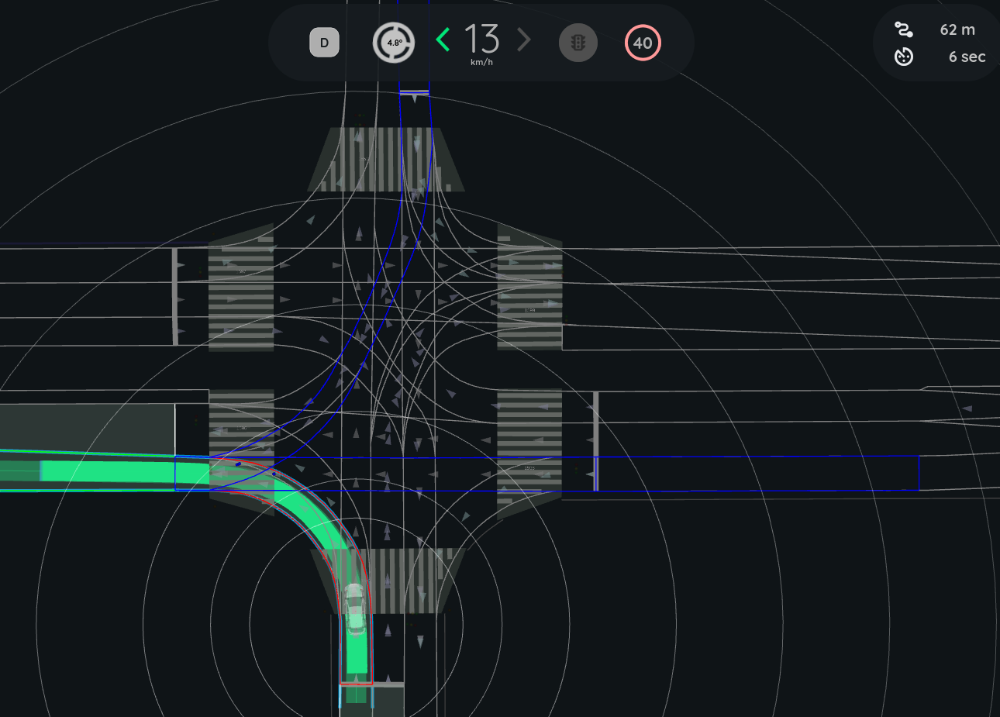

# Intersection Collision Checker

The `intersection_collision_checker` is a plugin module of `autoware_planning_validator` node. It is responsible for validating the planning trajectory at intersections by verifying that it does NOT lead to a collision with other road vehicles.

The check is executed only when:

- Ego is approaching a `turn_direction` lane
- Ego trajectory intersects with lanes other than `route_lanelets`

## Inner workings

The following steps describe the general approach taken to check for collisions at intersections:

- Compute ego trajectory lanelets and turning direction
- Compute target lanelets to check
- For each target lanelet set the `point_of_overlap` (i.e where ego trajectory intersects the lanelet), and compute ego's time to reach it.
- Filter obstacle pointclouds to remove unwanted points
- For each target lanelet:
  - process pointcloud points within lanelet and measure distance to `point_of_overlap`
  - estimate object velocity based on changes in distance measurements
  - estimate object's time to reach `point_of_overlap`
  - compare object's and ego's time to reach to determine if there is a risk of collision.

If it's determined that there is a risk of collision, a diagnostic is published to trigger an emergency stop by the MRM Handler.

### Target Lanelet Selection

#### Right turn

To get the target lanelets, we first find all lanelets intersecting with ego trajectory. Then we filter out:

- Lanelets that are `route_lanelets`
- Lanelets with a "time to reach" exceeding the time horizon
- Lanelets that have `turn_direction` attribute and are not `STRAIGHT`. (If parameter `right_turn.check_turning_lanes` is **FALSE**)
- Lanelets that are determined to be **crossing** lanes. (If parameter `right_turn.check_crossing_lanes` is **FALSE**)

Target lanelets are then expanded, if necessary, up to `detection_range`

The image below shows the target lanelets at a right turn intersection. (`right_turn.check_turning_lanes` set to **FALSE**)

#### Left turn

To get the target lanelets in case of a left turn:

- First we find the `turn_direction` lanelet from the Ego trajectory lanelets
- Then we find the next lanelet "destination_lanelet" following the `turn_direction` lanelet
- We then get all lanelets preceding the "destination_lanelet" and filter out:
  - Lanelets that are `route_lanelets`
  - Lanelets with a "time to reach" exceeding the time horizon
  - Lanelets that have `turn_direction` attribute and are not `STRAIGHT`. (If parameter `left_turn.check_turning_lanes` is **FALSE**)

Target lanelets are then expanded, if necessary, up to `detection_range`

The image below shows the target lanelets at a left turn intersection. (`left.check_turning_lanes` set to **TRUE**)

## Parameters

| Name               | Unit   | Type   | Description                                                                                 | Default value |
| :----------------- | ------ | ------ | ------------------------------------------------------------------------------------------- | ------------- |
| `enable`           | [-]    | bool   | Flag to enable/disable the check globally                                                   | true          |
| `detection_range`  | [m]    | double | Range of detection from ego position, pointcloud points beyond this range are filtered out  | 50.0          |
| `ttc_threshold`    | [s]    | double | Threshold value for the difference between ego and object reach times to trigger and a stop | 1.0           |
| `ego_deceleration` | [m/ss] | double | Ego deceleration relate used to estimate ego stopping time                                  | 1.0           |
| `min_time_horizon` | [s]    | double | Minimum time horizon to check ahead along ego trajectory                                    | 10.0          |
| `on_time_buffer`   | [s]    | double | Continuous collision detection time required to judge as unsafe                             | 0.5           |
| `off_time_buffer`  | [s]    | double | Continuous no collision detection time required to clear unsafe decision                    | 1.0           |

### Lanelet Selection Flags

| Name                                | Unit  | Type   | Description                                     | Default value |
| :---------------------------------- | ----- | ------ | ----------------------------------------------- | ------------- |
| `right_turn.enable`                 | [-]   | bool   | Flag to enable/disable the check at right turns | true          |
| `right_turn.check_crossing_lanes`   | [-]   | bool   | Flag to enable/disable checking crossing lanes  | true          |
| `right_turn.check_turn_lanes`       | [-]   | bool   | Flag to enable/disable checking turning lanes   | true          |
| `right_turn.crossing_lane_angle_th` | [rad] | double | Angle threshold for determining crossing lanes  | 0.785398      |
| `left_turn.enable`                  | [-]   | bool   | Flag to enable/disable the check at left turns  | true          |
| `left_turn.check_turn_lanes`        | [-]   | bool   | Flag to enable/disable checking turning lanes   | true          |

### Pointcloud Parameters

| Name                               | Unit | Type   | Description                                                                    | Default value |
| :--------------------------------- | ---- | ------ | ------------------------------------------------------------------------------ | ------------- |
| `pointcloud.height_buffer`         | [m]  | double | Height offset to add above ego vehicle height when filtering pointcloud points | true          |
| `pointcloud.min_height`            | [m]  | double | Minimum height threshold for filtering pointcloud points                       | 50.0          |
| `pointcloud.voxel_grid_filter.x`   | [m]  | double | x value for voxel leaf size                                                    | 1.0           |
| `pointcloud.voxel_grid_filter.y`   | [m]  | double | y value for voxel leaf size                                                    | 1.0           |
| `pointcloud.voxel_grid_filter.z`   | [m]  | double | z value for voxel leaf size                                                    | 10.0          |
| `pointcloud.clustering.tolerance`  | [m]  | double | Distance tolerance between two points in a cluster                             | 1.0           |
| `pointcloud.clustering.min_height` | [m]  | double | Minimum height of a cluster to be considered as a target                       | 1.0           |
| `pointcloud.clustering.min_size`   | [-]  | double | Minimum number of points in a cluster to be considered as a target             | 1.0           |
| `pointcloud.clustering.max_size`   | [-]  | double | Maximum number of points in a cluster to be considered as a target             | 1.0           |
| `pointcloud.observation_time`      | [s]  | double | Minimum detection time for a pointcloud object to be considered reliable       | 1.0           |
| `pointcloud.latency`               | [s]  | double | Time delay used to compensate for latency in pointcloud data                   | 1.0           |
